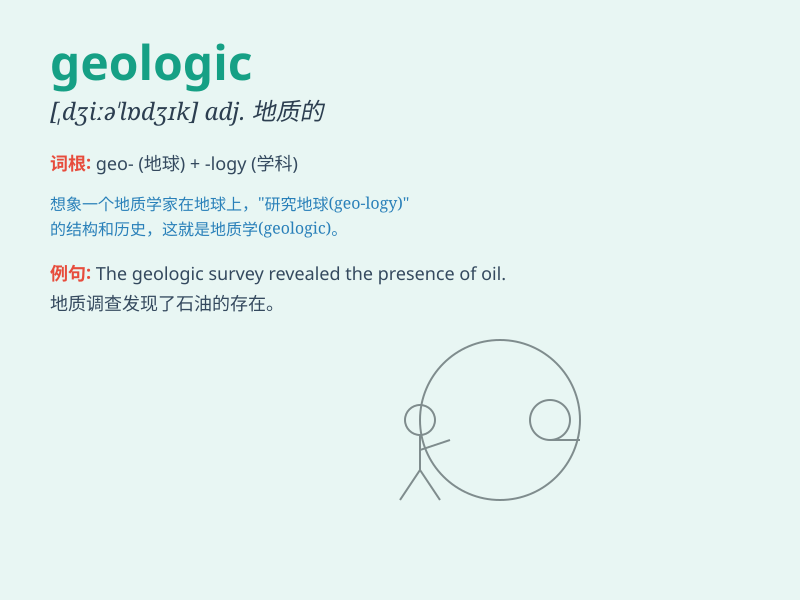

## geologic

**英音:** _[,dʒɪəʊ\'lɒdʒɪk]_ **美音:** _[dʒɪə\'lɑdʒɪk]_

**译义:** *adj.地质(学)的,地质(学)上的*

### 短语

+ **geologic time:** _地质时间_

+ **geologic structure:** _地质构造_

+ **geologic process:** _地质过程_

+ **geologic map:** _地质图_

+ **geologic formation:** _地质层组_

### 例句

#### 例句1

> **The geologic structure of this area is very complex.**

**中文翻译:** 该地区地质构造十分复杂。

**单词释义:** 地质的

#### 例句2

> **Geologic evidence suggests that a major earthquake occurred here
centuries ago.**

**中文翻译:** 地质证据表明，几个世纪前这里曾发生过一次大地震。

**单词释义:** 地质的

#### 例句3

> **The geologic survey revealed valuable mineral deposits.**

**中文翻译:** 地质调查发现了有价值的矿藏。

**单词释义:** 地质的

### 背诵小故事

> A brave geologist was exploring a cave. He found strange rocks and
fossils, realizing their geologic history. This adventure helped him
understand the secrets of the earth\'s formation. Remember, geologic is
all about the study of the earth\'s structure and history.

**一位勇敢的地质学家正在探索一个洞穴。他发现了奇怪的岩石和化石，了解到它们的地质历史。这次冒险帮助他理解了地球形成的秘密。记住，geologic
是关于地球结构和历史的研究。**

### 图义

