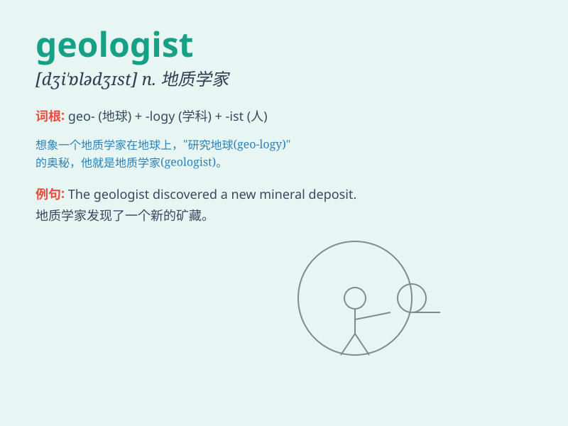

## geologist

**英音:** _[dʒɪ\'ɒlədʒɪst]_ **美音:** _[dʒɪ\'ɑlədʒɪst]_

**译义:** *n.地质学者*

### 短语

+ **petroleum geologist:** _石油地质学家_

+ **structural geologist:** _构造地质学家_

+ **economic geologist:** _经济地质学家_

+ **field geologist:** _野外地质学家_

+ **marine geologist:** _海洋地质学家_

### 例句

#### 例句1

> **The geologist studied the rock formations in the mountains.**

**中文翻译:** 地质学家研究了山上的岩层。

**单词释义:** 地质学家

#### 例句2

> **She became a famous geologist after years of research.**

**中文翻译:** 经过多年的研究，她成为了一位著名的地质学家。

**单词释义:** 地质学家

#### 例句3

> **The geologist discovered a new mineral deposit.**

**中文翻译:** 地质学家发现了一个新的矿藏。

**单词释义:** 地质学家

### 背诵小故事

> One day, a young man named Tom dreamt of becoming a geologist. He
traveled to mountains and deserts, studying rocks and minerals. Finally,
his hard work paid off, and he became a famous geologist.

**有一天，一个叫汤姆的年轻人梦想成为一名地质学家。他前往山脉和沙漠，研究岩石和矿物。最终，他的努力得到了回报，他成为了一位著名的地质学家。**

### 图义

