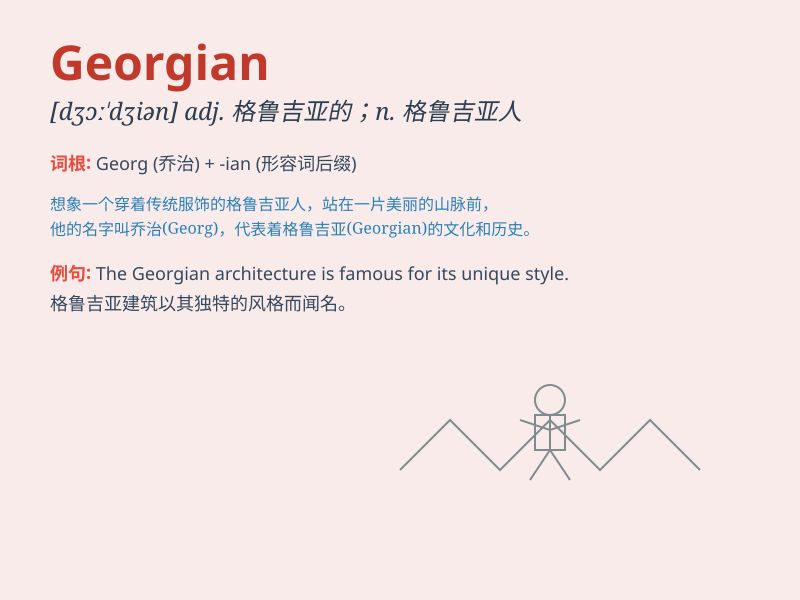

## Georgian

**英音:** _[dʒɔːˈdʒi.ən]_ **美音:** _[dʒɔrˈdʒi.ən]_

**译义:** *adj. 格鲁吉亚的；格鲁吉亚人的；乔治时期的；n.
格鲁吉亚人；乔治时期（约1714-1830年）的风格*

### 短语

+ **Georgian architecture:** _格鲁吉亚式建筑_

+ **Georgian era:** _乔治王朝时期_

+ **Georgian window:** _乔治式窗户_

+ **Georgian literature:** _格鲁吉亚文学_

+ **Georgian language:** _格鲁吉亚语_

### 例句

#### 例句1

> **The Georgian architecture of the building is truly
magnificent.**

**中文翻译:** 这座建筑的格鲁吉亚式建筑风格确实宏伟壮观。

**单词释义:** 格鲁吉亚的；格鲁吉亚人的；格鲁吉亚语的

#### 例句2

> **She is studying Georgian history at the university.**

**中文翻译:** 她在大学里学习格鲁吉亚历史。

**单词释义:** 格鲁吉亚的

#### 例句3

> **The Georgian language has its own unique alphabet.**

**中文翻译:** 格鲁吉亚语有其独特的字母表。

**单词释义:** 格鲁吉亚的；格鲁吉亚语的

### 背诵小故事

> Imagine you are visiting a beautiful Georgian house. It has elegant
columns and a charming garden. The owner, a friendly Georgian lady,
welcomes you with a warm smile. You remember \'Georgian\' as the style
of this lovely house and the people from Georgia.

**想象一下你正在参观一座漂亮的格鲁吉亚风格的房子。它有优雅的柱子和迷人的花园。房子的主人，一位友好的格鲁吉亚女士，带着温暖的微笑欢迎你。你记住\'Georgian\'就是这种可爱房子的风格以及来自格鲁吉亚的人。**

### 图义

