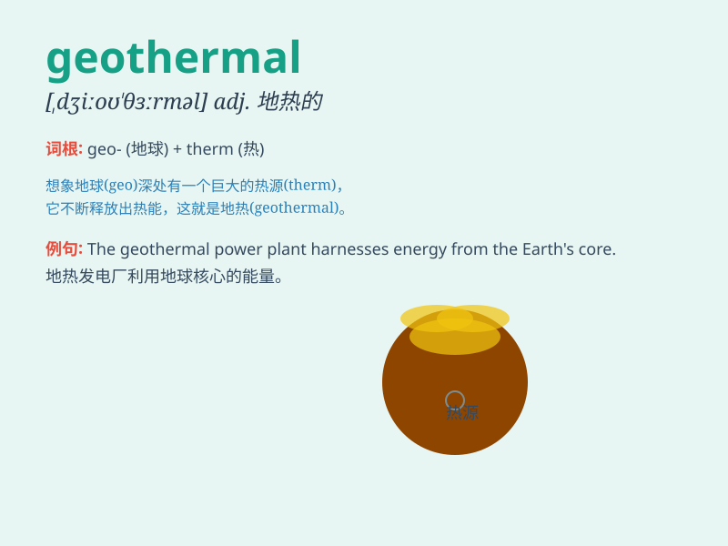

## geothermal

**英音:** _[dʒiːə(ʊ)\'θɜːm(ə)l]_ **美音:**
_[,dʒio\'θɝml]_

**译义:** *adj.地热的,地温的,地热(或地温)产生的*

### 短语

+ **geothermal energy:** _地热能_

+ **geothermal power:** _地热发电_

+ **geothermal reservoir:** _地热储层_

+ **geothermal well:** _地热井_

+ **geothermal heating:** _地热供暖_

### 例句

#### 例句1

> **Geothermal energy is a clean and renewable source of power.**

**中文翻译:** 地热能是一种清洁、可再生的能源。

**单词释义:** 地热的

#### 例句2

> **The country is exploring the potential of geothermal heating for
residential areas.**

**中文翻译:** 该国正在探索住宅区地热供暖的潜力。

**单词释义:** 地热的

#### 例句3

> **They developed a geothermal power plant to meet the local
electricity demand.**

**中文翻译:** 他们开发了一座地热发电厂来满足当地的电力需求。

**单词释义:** 地热的

### 背诵小故事

> A scientist was exploring a cave and felt a warm gust. He realized it
was geothermal energy. The heat from deep within the Earth made the cave
special. Remember, geothermal means related to heat from inside the
Earth.

**一位科学家在探索一个洞穴时，感觉到一股温暖的气流。他意识到这是地热能。来自地球深处的热量使这个洞穴很特别。记住，geothermal
意思是与地球内部的热量有关的。**

### 图义

