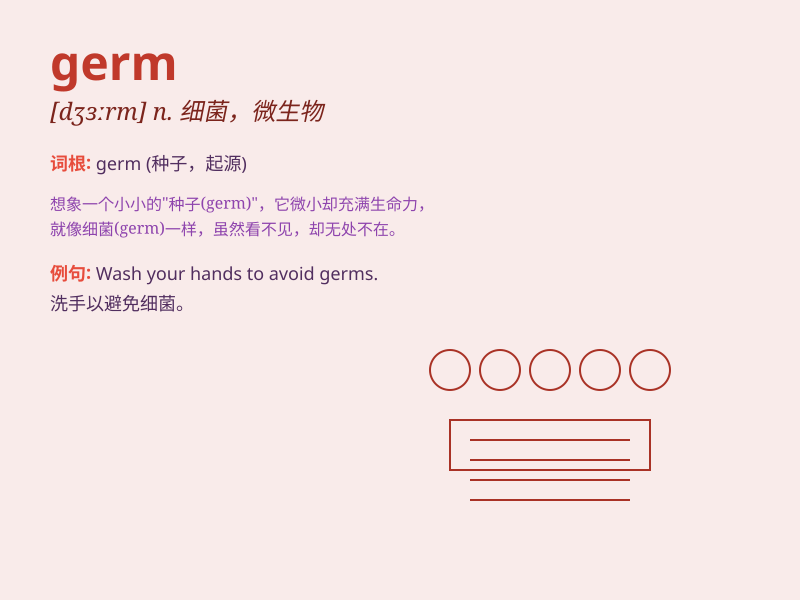

## germ

**英音:** _[dʒɜːm]_ **美音:** _[dʒɝm]_

**译义:** *n.微生物,细菌*

### 短语

+ **germ warfare:** _细菌战_

+ **germ cell:** _生殖细胞_

+ **germ layer:** _胚层_

+ **germ theory:** _病菌学说_

+ **germ carrier:** _带菌者_

### 例句

#### 例句1

> **The germ of an idea began to form in her mind.**

**中文翻译:** 一个想法的萌芽开始在她脑海中形成。

**单词释义:** 萌芽；起源

#### 例句2

> **Disinfectants can kill germs.**

**中文翻译:** 消毒剂可以杀灭细菌。

**单词释义:** 细菌；病菌

#### 例句3

> **This is the germ of a new novel.**

**中文翻译:** 这是一部新小说的雏形。

**单词释义:** 雏形；胚芽

### 背诵小故事

> A scientist was studying in a secret lab. One day, he found a tiny
thing under the microscope. It was a germ! This germ was so small but
had the potential to cause big diseases.

**一位科学家在秘密实验室里进行研究。有一天，他在显微镜下发现了一个极小的东西。那是一个细菌！这个细菌虽小，但却有引发重大疾病的可能。**

### 图义

