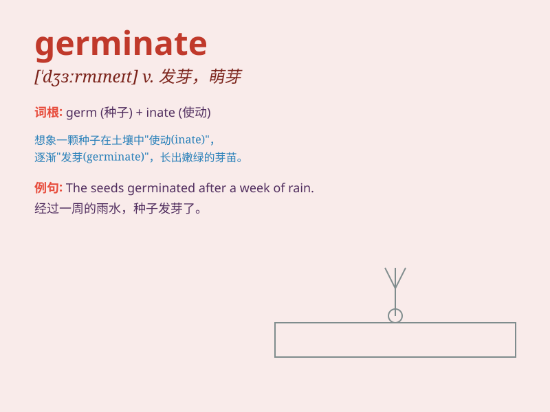

## germinate

**英音:** _[\'dʒɜːmɪneɪt]_ **美音:** _[\'dʒɝmɪnet]_

**译义:** *v.发芽,发育,使生长*

### 短语

+ **germinate seeds:** _使种子发芽_

+ **germinate ideas:** _萌发想法_

+ **germinate slowly:** _缓慢发芽_

+ **begin to germinate:** _开始发芽_

+ **germinate easily:** _容易发芽_

### 例句

#### 例句1

> **The seeds will germinate in a few days if you keep the soil
moist.**

**中文翻译:** 如果你保持土壤湿润，这些种子几天后就会发芽。

**单词释义:** 发芽

#### 例句2

> **New ideas often germinate from unexpected sources.**

**中文翻译:** 新的想法常常从意想不到的来源萌发。

**单词释义:** 萌发

#### 例句3

> **The plan began to germinate in his mind after the meeting.**

**中文翻译:** 会议结束后，这个计划在他脑海中开始形成。

**单词释义:** 形成

### 背诵小故事

>
想象一颗小小的种子在温暖的土壤里。春天来了，它感受到阳光和雨水，于是开始努力生长，破壳而出。这就是\'germinate\'，就像种子开始发芽生长。

**想象一颗种子开始发芽生长的过程来辅助记忆\'germinate\'这个单词，意思是（使）发芽，（使）生长**

### 图义

