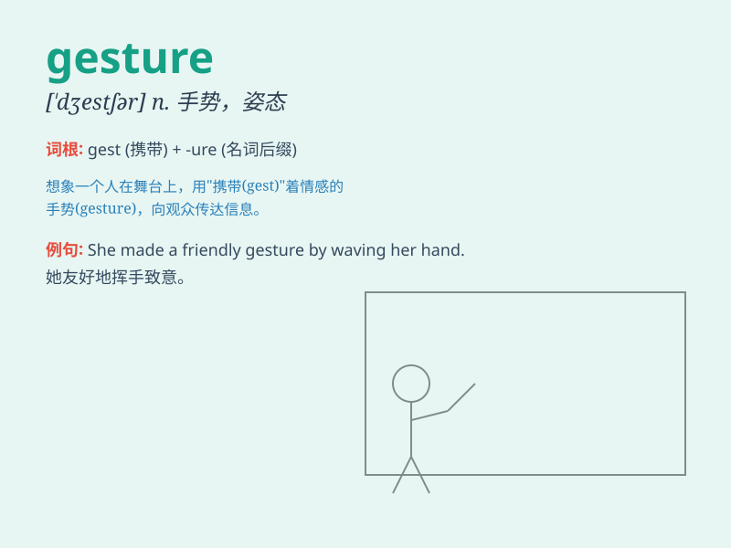

## gesture

**英音:** _[\'dʒestʃə]_ **美音:** _[\'dʒɛstʃɚ]_

**译义:** *n.姿态,手势,表示v.作手势,以手势表示*

### 短语

+ **make a gesture:** _做手势_

+ **gesture language:** _手势语_

+ **in a gesture of:** _以\...\...的姿态_

+ **gesture of invitation:** _邀请的手势_

+ **angry gesture:** _愤怒的手势_

### 例句

#### 例句1

> **He made a gesture of apology.**

**中文翻译:** 他做了一个道歉的手势。

**单词释义:** 手势；姿势

#### 例句2

> **The waitress gestured towards the empty table.**

**中文翻译:** 女服务员朝空桌子做了个手势。

**单词释义:** 用手势表示

#### 例句3

> **Her angry gesture frightened the children.**

**中文翻译:** 她生气的姿势把孩子们吓到了。

**单词释义:** 姿势；姿态

### 背诵小故事

> A thief broke into a house. The owner, without making a sound, made a
gesture of calling the police to warn the thief. The thief saw the
gesture and ran away scared.

**一个小偷闯进了一所房子。主人没有出声，做了一个打电话报警的手势来警告小偷。小偷看到这个手势，吓得跑掉了。**

### 图义

