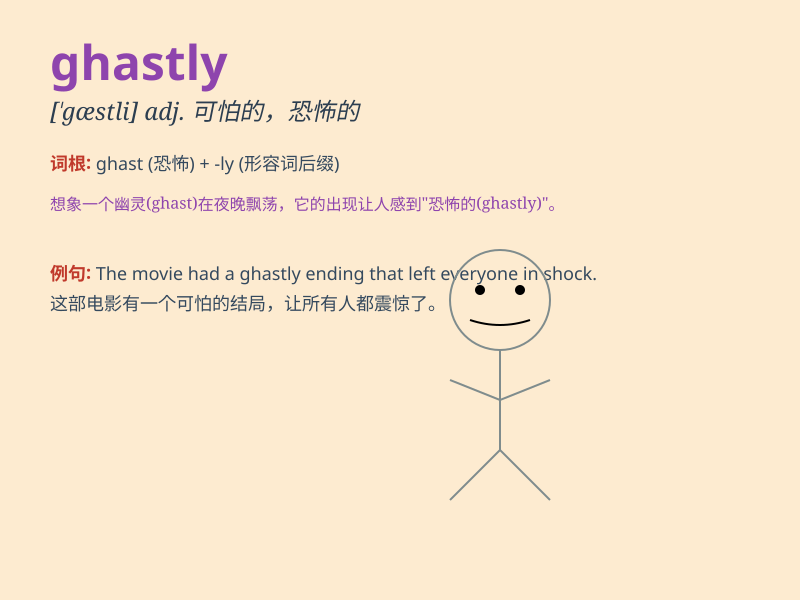

## ghastly

**英音:** _[gɑːs(t)lɪ]_ **美音:** _[ˈɡæstli]_

**译义:** *adj.苍白的,死人般的,可怕的,惊人的adv.可怖地,惨白地*

### 短语

+ **ghastly crime:** _可怕的罪行_

+ **ghastly mistake:** _严重的错误_

+ **ghastly accident:** _恐怖的事故_

+ **ghastly face:** _惨白的脸_

+ **ghastly experience:** _可怕的经历_

### 例句

#### 例句1

> **The accident scene was a ghastly sight.**

**中文翻译:** 事故现场是一幅可怕的景象。

**单词释义:** 可怕的；恐怖的

#### 例句2

> **She looked ghastly after the long illness.**

**中文翻译:** 久病之后她看上去很憔悴。

**单词释义:** 苍白的；憔悴的

#### 例句3

> **The food at that restaurant was ghastly.**

**中文翻译:** 那家餐馆的食物糟透了。

**单词释义:** 极坏的；糟糕的

### 背诵小故事

> A brave knight was exploring an old castle. In a dark room, he saw a
ghastly figure with a pale face and bloodshot eyes. It was so terrifying
that the knight almost fainted. Later he found it was just a mirror
reflecting his own scared look.

**一位勇敢的骑士正在探索一座古老的城堡。在一个黑暗的房间里，他看到了一个可怕的身影，脸色苍白，眼睛布满血丝。这太恐怖了，骑士几乎昏厥。后来他发现那只是一面镜子反射出他自己惊恐的样子。**

### 图义

