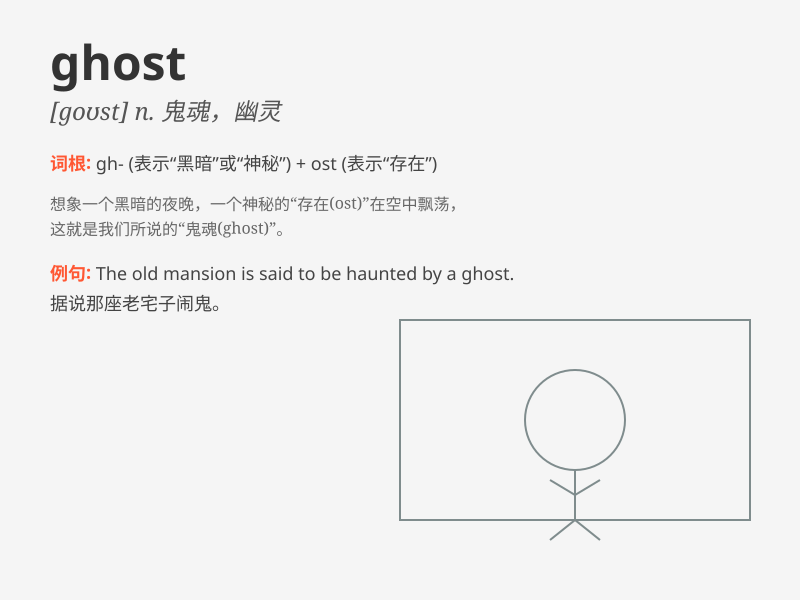

## ghost

**英音:** _[gəʊst]_ **美音:** _[ɡost]_

**译义:** *n.鬼,幽灵*

### 短语

+ **ghost town:** _被遗弃的城镇_

+ **ghost story:** _鬼故事_

+ **ghost writer:** _代笔人；捉刀人_

+ **give up the ghost:** _死；断气_

+ **Holy Ghost:** _圣灵_

### 例句

#### 例句1

> **The old house is said to be haunted by a ghost.**

**中文翻译:** 据说这座老房子有鬼魂出没。

**单词释义:** 鬼魂；幽灵

#### 例句2

> **He looks like a ghost with that pale face.**

**中文翻译:** 他那张苍白的脸看起来就像一个幽灵。

**单词释义:** 幽灵般的人；苍白的人

#### 例句3

> **The memory of her still haunts him like a ghost.**

**中文翻译:** 关于她的记忆仍然像幽灵一样萦绕在他的心头。

**单词释义:** 幽灵般的事物；难以忘怀的事

### 背诵小故事

> One night, a little boy was alone in a dark room. Suddenly, he saw a
white figure. It was a ghost! The ghost floated silently and scared the
boy. But then the boy realized it was just a dream.

**一天晚上，一个小男孩独自在一个黑暗的房间里。突然，他看到一个白色的身影。那是一个鬼魂！鬼魂静静地飘着，把小男孩吓到了。但后来小男孩意识到这只是一场梦。**

### 图义

