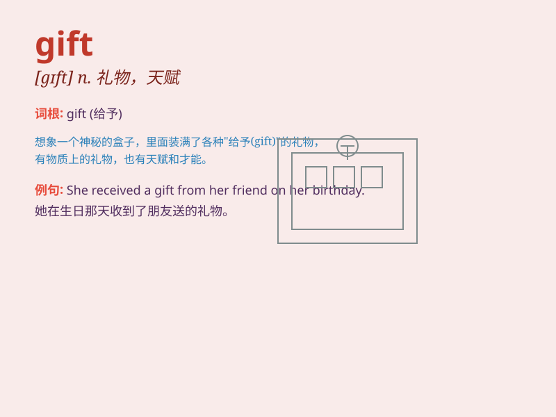

## gift

**英音:** _[gɪft]_ **美音:** _[ɡɪft]_

**译义:** *n.赠品,礼物,天赋,才能*

### 短语

+ **gift box:** _礼品盒_

+ **gift card:** _礼品卡_

+ **gift wrap:** _礼品包装纸_

+ **gift voucher:** _礼券_

+ **birthday gift:** _生日礼物_

### 例句

#### 例句1

> **She has a gift for music.**

**中文翻译:** 她有音乐天赋。

**单词释义:** 天赋；才能

#### 例句2

> **He gave me a beautiful gift on my birthday.**

**中文翻译:** 他在我生日时给了我一份漂亮的礼物。

**单词释义:** 礼物

#### 例句3

> **The young athlete was regarded as a gift to the sport.**

**中文翻译:** 这位年轻的运动员被视为这项运动的奇才。

**单词释义:** 天才；有天赋的人

### 背诵小故事

> One day, on my birthday, my friend came with a beautifully wrapped
box. When I opened it, I found a lovely necklace inside. It was a
wonderful gift that made me so happy.

**有一天，在我生日那天，我的朋友带着一个包装精美的盒子来了。当我打开它时，我发现里面有一条可爱的项链。这是一份很棒的礼物，让我非常开心。**

### 图义

