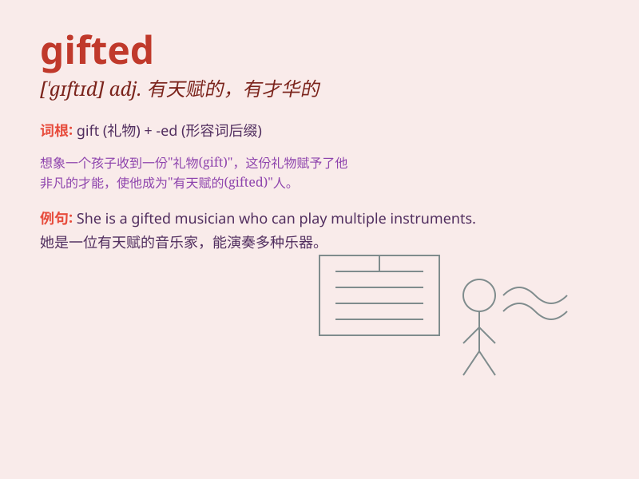

## gifted

**英音:** _[\'gɪftɪd]_ **美音:** _[\'ɡɪftɪd]_

**译义:** *adj.有天才的*

### 短语

+ **gifted child:** _有天赋的孩子_

+ **gifted student:** _有天赋的学生_

+ **gifted musician:** _有天赋的音乐家_

+ **gifted athlete:** _有天赋的运动员_

+ **gifted writer:** _有天赋的作家_

### 例句

#### 例句1

> **She is a gifted musician who can play several instruments.**

**中文翻译:** 她是一位有天赋的音乐家，能演奏好几种乐器。

**单词释义:** 有天赋的

#### 例句2

> **The gifted student solved the math problem within minutes.**

**中文翻译:** 这位有天赋的学生在几分钟内就解决了这道数学题。

**单词释义:** 有天赋的

#### 例句3

> **He has a gifted ability to understand complex theories.**

**中文翻译:** 他有一种理解复杂理论的天赋能力。

**单词释义:** 天赋的

### 背诵小故事

> Once upon a time, there was a little girl named Lily. She was very
talented in music and could play the piano beautifully. Everyone said
she was gifted. Soon, she performed on a big stage and amazed the
audience.

**从前，有个叫莉莉的小女孩。她在音乐方面很有天赋，钢琴弹得非常好。大家都说她是有天赋的。很快，她在一个大舞台上表演，让观众惊叹不已。**

### 图义

