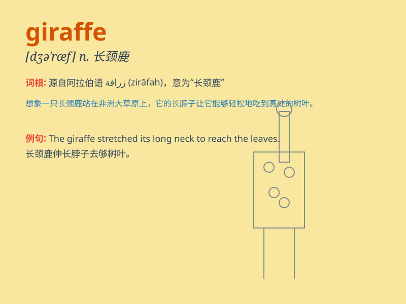

## giraffe

**英音:** _[dʒɪˈrɑ:f]_ **美音:** _[dʒəˈræf; dʒəˈræf]_

**译义:** *n.长颈鹿,鹿豹座*

### 短语

+ **giraffe neck:** _长颈鹿的脖子_

+ **baby giraffe:** _长颈鹿幼崽_

+ **tall giraffe:** _高的长颈鹿_

+ **giraffe herd:** _长颈鹿群_

+ **giraffe pattern:** _长颈鹿的图案_

### 例句

#### 例句1

> **The giraffe is the tallest animal in the zoo.**

**中文翻译:** 长颈鹿是动物园里最高的动物。

**单词释义:** 长颈鹿

#### 例句2

> **I saw a giraffe eating leaves from a tall tree.**

**中文翻译:** 我看到一只长颈鹿正在吃一棵高树上的叶子。

**单词释义:** 长颈鹿

#### 例句3

> **The children were excited to see the giraffe at the safari
park.**

**中文翻译:** 孩子们很高兴在野生动物园看到长颈鹿。

**单词释义:** 长颈鹿

### 背诵小故事

> A little girl went to the zoo and saw a very tall animal. It had a
long neck and beautiful spots. The zookeeper told her it was a giraffe.
The girl was amazed and never forgot this special animal.

**一个小女孩去动物园，看到了一只非常高的动物。它有长长的脖子和漂亮的斑点。动物园管理员告诉她这是一只长颈鹿。小女孩很惊讶，永远忘不了这种特别的动物。**

### 图义

