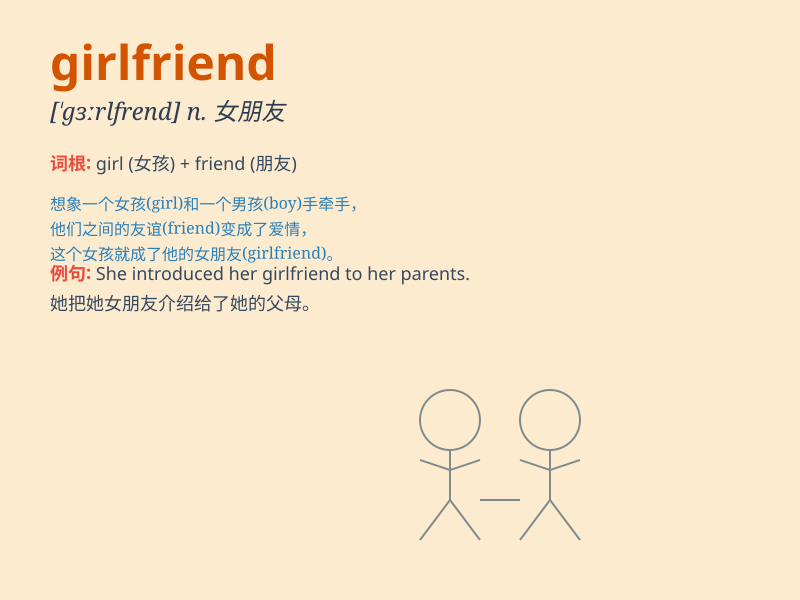

## girlfriend

**英音:** _[\'ɡɜːl.frend]_ **美音:** _[\'ɡɝːl.frend]_

**译义:** *n. 女朋友*

### 短语

+ **long-term girlfriend:** _长期女友_

+ **ex-girlfriend:** _前女友_

+ **new girlfriend:** _新女友_

+ **serious girlfriend:** _认真交往的女友_

+ **steady girlfriend:** _关系稳定的女友_

### 例句

#### 例句1

> **I met my girlfriend at the coffee shop.**

**中文翻译:** 我在咖啡店见到了我的女朋友。

**单词释义:** 女朋友

#### 例句2

> **He bought a beautiful necklace for his girlfriend.**

**中文翻译:** 他给他的女朋友买了一条漂亮的项链。

**单词释义:** 女朋友

#### 例句3

> **My girlfriend is very kind and understanding.**

**中文翻译:** 我的女朋友非常善良和善解人意。

**单词释义:** 女朋友

### 背诵小故事

> A boy was very lonely. One day, he met a nice girl and they spent a
lot of time together. Soon, she became his girlfriend and brought him
joy and love. They had many happy memories.

**一个男孩非常孤独。有一天，他遇到了一个好女孩，他们一起度过了很多时间。很快，她成了他的女朋友，给他带来了快乐和爱。他们有很多美好的回忆。**

### 图义

