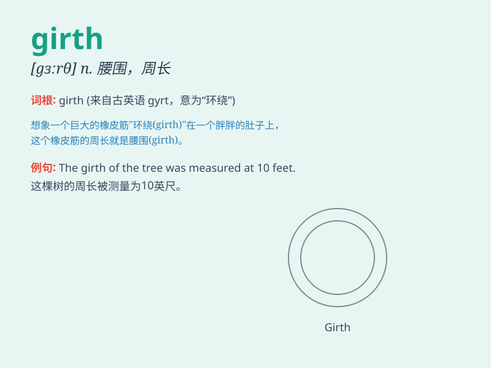

## girth

**英音:** _[gɜːθ]_ **美音:** _[ɡɝθ]_

**译义:** *n.周长,(马等的)肚带,腰身vt.以带束缚,围绕,包围vi.围长为*

### 短语

+ **waist girth:** _腰围_

+ **chest girth:** _胸围_

+ **hip girth:** _臀围_

+ **girth measurement:** _周长测量_

+ **increase in girth:** _周长增加_

### 例句

#### 例句1

> **The girth of the tree trunk was over two meters.**

**中文翻译:** 树干的周长有两米多。

**单词释义:** 周长；围长

#### 例句2

> **He measured the girth of his waist to keep track of his weight
loss.**

**中文翻译:** 他测量了自己的腰围，以记录自己的体重减轻情况。

**单词释义:** 腰围；周长

#### 例句3

> **The saddle was too small for the horse\'s girth.**

**中文翻译:** 马鞍对于马的周长来说太小了。

**单词释义:** 胸围

### 背诵小故事

> A knight was worried about the girth of his horse\'s saddle. If it
was too loose, he might fall during the battle. So, he checked and
tightened the girth carefully. The girth is the measurement around
something, like a horse\'s middle.

**一位骑士担心他的马的马鞍的周长。如果太松，他可能会在战斗中掉落。所以，他仔细检查并收紧了周长。girth
指的是某物周围的长度测量，比如马的中部。**

### 图义

