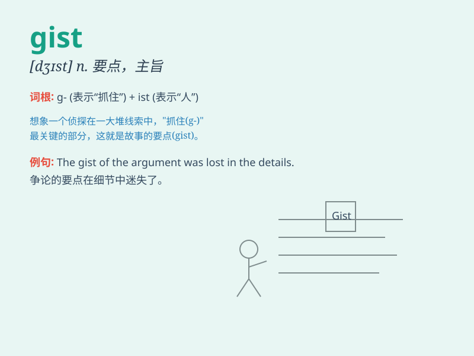

## gist

**英音:** _[dʒɪst]_ **美音:** _[dʒɪst]_

**译义:** *n.要点,要旨,依据,[法律]诉讼主因*

### 短语

+ **the gist of:** _\...\...的要点_

+ **get the gist:** _领会要点_

+ **miss the gist:** _错过要点_

+ **understand the gist:** _理解要点_

+ **explain the gist:** _解释要点_

### 例句

#### 例句1

> **The gist of her argument was that we needed to act quickly.**

**中文翻译:** 她的论点要点是我们需要迅速采取行动。

**单词释义:** 要点；主旨

#### 例句2

> **I think I understand the gist of the problem.**

**中文翻译:** 我想我明白了问题的要点。

**单词释义:** 主旨；要点

#### 例句3

> **He quickly grasped the gist of the story.**

**中文翻译:** 他很快就掌握了故事的要点。

**单词释义:** 要点

### 背诵小故事

> A detective was trying to solve a mystery. After gathering many
clues, the gist of the case was that the thief was the butler. The
detective finally caught the culprit based on this key understanding.

**一位侦探试图侦破一个谜团。在收集了许多线索后，案件的要点是小偷是管家。侦探最终基于这个关键的理解抓住了罪犯。**

### 图义

