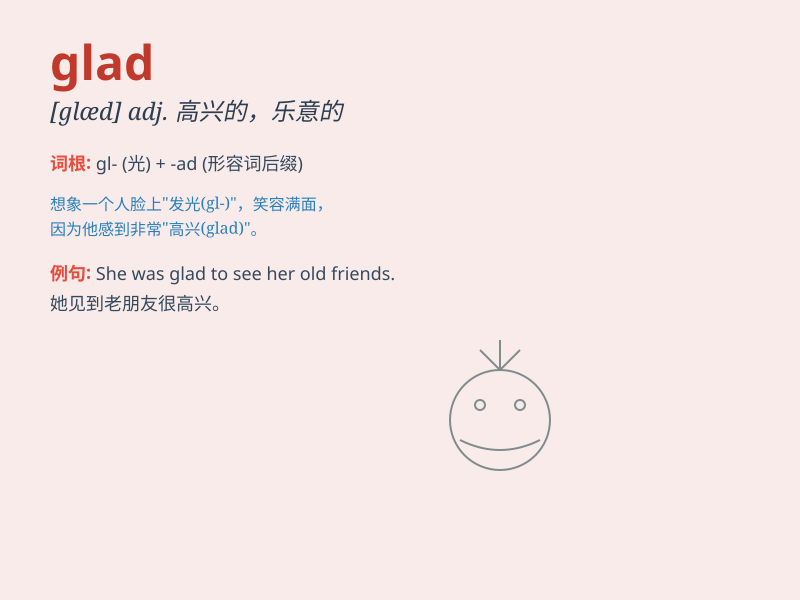

## glad

**英音:** _[glæd]_ **美音:** _[ɡlæd]_

**译义:** *adj.高兴的,乐意的,感到高兴的*

### 短语

+ **glad to do:** _乐意做某事_

+ **be glad of:** _为\...\...感到高兴_

+ **be glad about:** _对\...\...感到高兴_

+ **be glad that:** _很高兴\...\..._

+ **give sb. a glad look:** _给某人一个高兴的表情_

### 例句

#### 例句1

> **I\'m glad to see you.**

**中文翻译:** 我很高兴见到你。

**单词释义:** 高兴的

#### 例句2

> **She was glad that the problem was solved.**

**中文翻译:** 她很高兴问题解决了。

**单词释义:** 高兴的

#### 例句3

> **We\'ll be glad to help you.**

**中文翻译:** 我们将很乐意帮助你。

**单词释义:** 乐意的；高兴的

### 背诵小故事

> One day, I got a high score in the exam. My parents were glad. They
smiled and gave me a big hug. I felt their joy and love. \'Glad\' means
happy and pleased.

**有一天，我在考试中取得了高分。我的父母很高兴。他们笑着给了我一个大大的拥抱。我感受到了他们的喜悦和爱。'glad'意思是开心的、高兴的。**

### 图义

