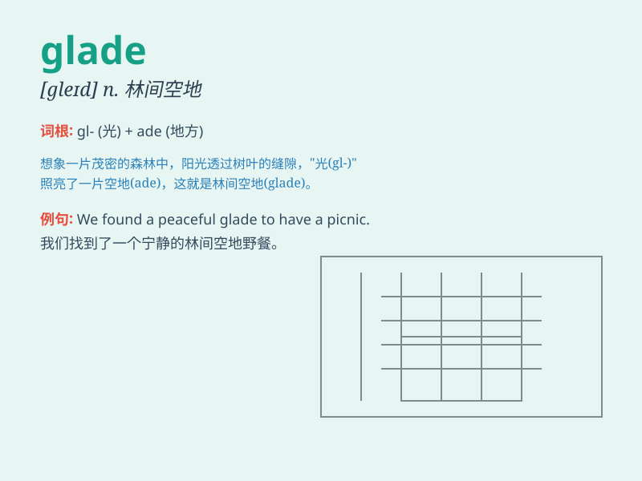

## glade

**英音:** _[ɡleɪd]_ **美音:** _[ɡleɪd]_

**译义:** *n.林间空地,一片表面有草的沼泽低地*

### 短语

+ **open glade:** _开阔的林间空地_

+ **sunny glade:** _阳光明媚的林间空地_

+ **quiet glade:** _安静的林间空地_

+ **lush glade:** _草木茂盛的林间空地_

+ **secluded glade:** _僻静的林间空地_

### 例句

#### 例句1

> **We walked through the glade and enjoyed the beautiful
scenery.**

**中文翻译:** 我们穿过林间空地，欣赏美丽的风景。

**单词释义:** 林间空地

#### 例句2

> **The deer often come to the glade to graze.**

**中文翻译:** 鹿经常来到这片林间空地吃草。

**单词释义:** 林间空地

#### 例句3

> **In the middle of the forest, there is a peaceful glade.**

**中文翻译:** 在森林的中央，有一片宁静的林间空地。

**单词释义:** 林间空地

### 背诵小故事

> A brave adventurer was lost in the forest. But suddenly, he found a
glade, a peaceful open area filled with beautiful flowers and gentle
sunlight. It was like a hidden paradise that gave him hope and a way
out.

**一位勇敢的探险家在森林中迷路了。但突然，他发现了一片林间空地，一个充满美丽花朵和柔和阳光的宁静开阔区域。它就像一个隐藏的天堂，给了他希望和出路。**

### 图义

