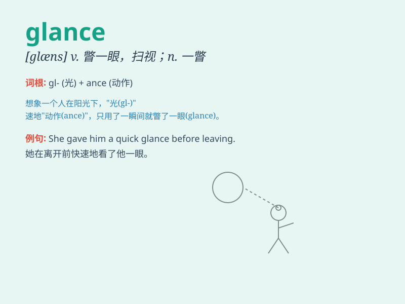

## glance

**英音:** _[glɑːns]_ **美音:** _[ɡlæns]_

**译义:** *vi.扫视,匆匆一看n.一瞥,眼光,匆匆一看*

### 短语

+ **at a glance:** _一眼；立刻_

+ **glance at:** _匆匆一看；扫视_

+ **give a glance:** _看一眼_

+ **cast a glance:** _瞥一眼；扫视_

+ **steal a glance:** _偷看；偷瞥_

### 例句

#### 例句1

> **She glanced at the clock and realized she was late.**

**中文翻译:** 她瞥了一眼时钟，意识到自己迟到了。

**单词释义:** 匆匆一看；瞥

#### 例句2

> **He gave her a quick glance and smiled.**

**中文翻译:** 他快速地看了她一眼然后笑了。

**单词释义:** 匆匆一看；瞥

#### 例句3

> **I took a glance at the newspaper headlines.**

**中文翻译:** 我扫了一眼报纸的标题。

**单词释义:** 匆匆一看；瞥

### 背诵小故事

> One day, Tom was walking in the park. A beautiful bird flew by and he
just took a quick glance at it. The bird was so colorful that the moment
of that glance left a deep impression on him.

**一天，汤姆在公园里散步。一只漂亮的鸟飞过，他快速瞥了一眼。这只鸟色彩斑斓，那一眼的瞬间给他留下了深刻的印象。**

### 图义

