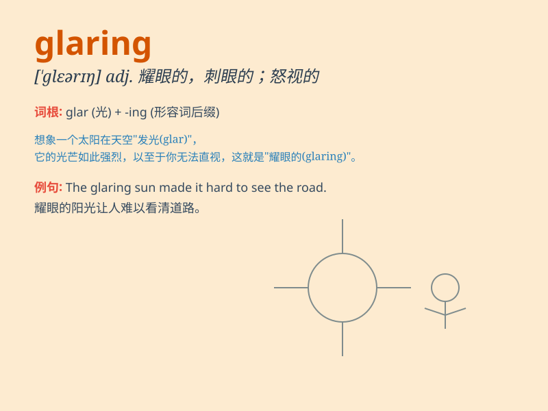

## glaring

**英音:** _[\'gleərɪŋ]_ **美音:** _[\'ɡlɛrɪŋ]_

**译义:** *adj.耀眼的*

### 短语

+ **glaring error:** _明显的错误_

+ **glaring light:** _耀眼的光_

+ **glaring contrast:** _鲜明的对比_

+ **glaring injustice:** _极度的不公_

+ **glaring omission:** _明显的遗漏_

### 例句

#### 例句1

> **The glaring sun made it difficult to see.**

**中文翻译:** 耀眼的太阳让人难以看清。

**单词释义:** 耀眼的；炫目的

#### 例句2

> **There was a glaring mistake in his report.**

**中文翻译:** 他的报告中有一个明显的错误。

**单词释义:** 明显的；显著的

#### 例句3

> **She gave him a glaring look when he interrupted her.**

**中文翻译:** 当他打断她时，她狠狠地瞪了他一眼。

**单词释义:** 怒目而视的；瞪眼的

### 背诵小故事

> A thief was trying to steal in the dark. Suddenly, a glaring light
from a flashlight exposed him. The bright and intense light was so
glaring that he couldn\'t escape.

**一个小偷在黑暗中试图行窃。突然，一束手电筒发出的耀眼光芒暴露了他。这束明亮而强烈的光太耀眼了，以至于他无法逃脱。**

### 图义

