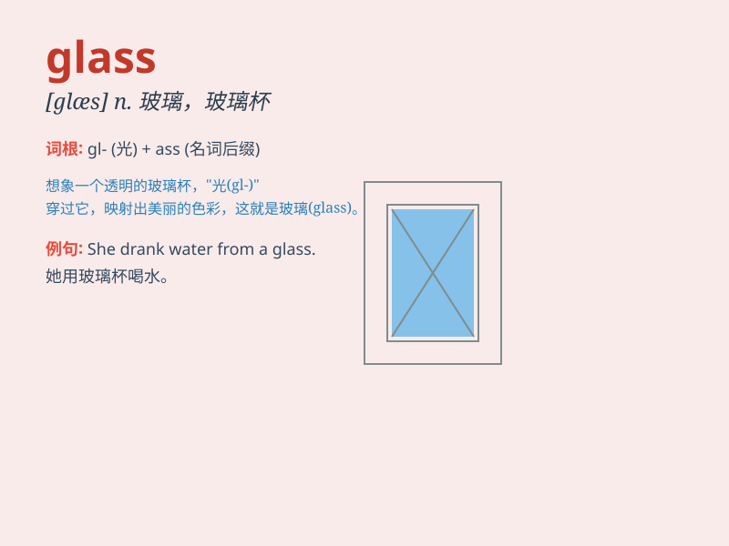

## glass

**英音:** _[glɑːs]_ **美音:** _[ɡlæs]_

**译义:**
*n.玻璃,玻璃制品,玻璃杯,镜子,眼镜,望远镜,气压计,晴雨表vt.装玻璃于,反映vi.成玻璃状*

### 短语

+ **glass bottle:** _玻璃瓶_

+ **glass window:** _玻璃窗_

+ **glass table:** _玻璃桌_

+ **drinking glass:** _饮水杯_

+ **glass ceiling:** _玻璃天花板（指无形的限制或障碍）_

### 例句

#### 例句1

> **I broke a glass while washing dishes.**

**中文翻译:** 我在洗碗的时候打碎了一个玻璃杯。

**单词释义:** 玻璃杯

#### 例句2

> **She looked at herself in the mirror through her glasses.**

**中文翻译:** 她透过眼镜在镜子里看着自己。

**单词释义:** 眼镜

#### 例句3

> **The window glass was shattered by the storm.**

**中文翻译:** 窗户玻璃被暴风雨打碎了。

**单词释义:** 玻璃

### 背诵小故事

> A little mouse was very thirsty. It climbed onto a table and found a
glass full of water. But the glass was too tall for it to reach.
Finally, with great effort, it managed to drink the water.

**一只小老鼠非常口渴。它爬上桌子，发现了一个装满水的玻璃杯。但杯子太高，它够不着。最后，费了好大劲，它终于喝到了水。**

### 图义

