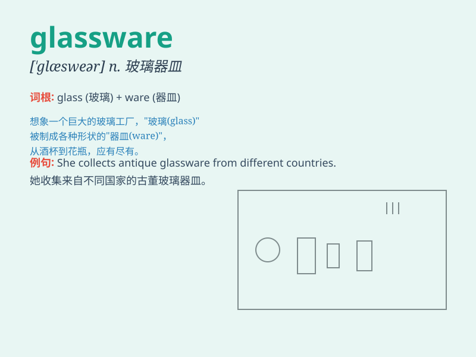

## glassware

**英音:** _[ˈɡlɑːsweə(r)]_ **美音:** _[ˈɡlæswer]_

**译义:** *n.玻璃器具类*

### 短语

+ **stemware glassware:** _高脚玻璃器皿_

+ **crystal glassware:** _水晶玻璃器皿_

+ **colored glassware:** _彩色玻璃器皿_

+ **handmade glassware:** _手工玻璃器皿_

+ **decorative glassware:** _装饰性玻璃器皿_

### 例句

#### 例句1

> **The store offers a wide range of glassware for different
occasions.**

**中文翻译:** 这家商店为不同的场合提供各种各样的玻璃器皿。

**单词释义:** 玻璃器皿

#### 例句2

> **She carefully washed the delicate glassware after the party.**

**中文翻译:** 聚会结束后，她小心地清洗了那些精致的玻璃器皿。

**单词释义:** 玻璃器皿

#### 例句3

> **The display cabinet was filled with beautiful glassware.**

**中文翻译:** 展示柜里摆满了漂亮的玻璃器皿。

**单词释义:** 玻璃器皿

### 背诵小故事

> One day, I went to a party. The host showed me beautiful glassware,
like delicate wine glasses and elegant vases. I was amazed by the shiny
and fragile glassware. It made the party more charming.

**有一天，我去参加一个聚会。主人向我展示了漂亮的玻璃器皿，比如精致的酒杯和优雅的花瓶。我对这些闪亮又易碎的玻璃器皿感到惊叹。它们让聚会更具魅力。**

### 图义

