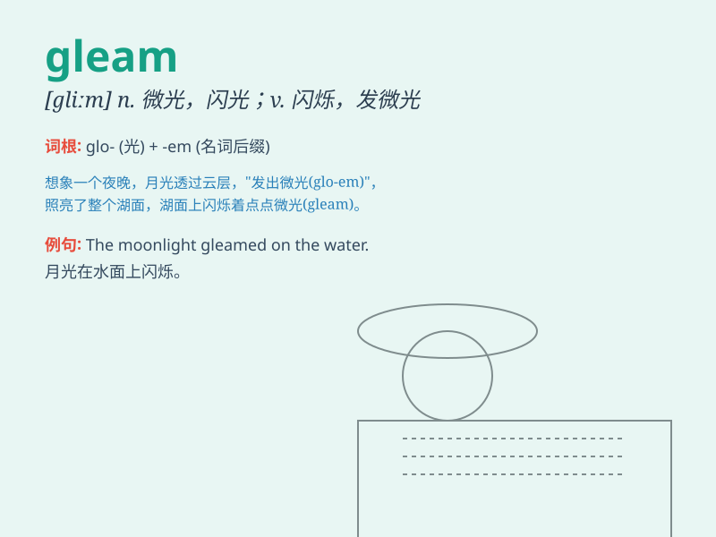

## gleam

**英音:** _[gliːm]_ **美音:** _[ɡlim]_

**译义:**
*n.微弱的闪光,一丝光线,瞬息的一现vi.闪烁,隐约地闪现vt.使发微光,使闪烁*

### 短语

+ **gleam with delight:** _因高兴而闪闪发光_

+ **gleam in the eye:** _眼中闪烁（某种神情）_

+ **a gleam of hope:** _一线希望_

+ **gleam of light:** _微弱的光_

+ **gleam of intelligence:** _智慧的光芒_

### 例句

#### 例句1

> **The moon gleamed through the clouds.**

**中文翻译:** 月亮透过云层闪烁着。

**单词释义:** 闪烁；发微光

#### 例句2

> **Her eyes gleamed with excitement.**

**中文翻译:** 她的眼睛因兴奋而闪闪发光。

**单词释义:** （眼睛）闪现，流露

#### 例句3

> **The polished floor gleamed under the lights.**

**中文翻译:** 光亮的地板在灯光下闪闪发亮。

**单词释义:** 反光；闪耀

### 背诵小故事

>
在一个黑暗的洞穴中，一束微弱的光线gleam进来，照亮了探险家的路。他顺着这道gleam，发现了隐藏的宝藏。光线的闪烁和引导，让他记住了gleam这个表示闪烁、微光的单词。

**在一个黑暗的洞穴中，一束微弱的光线闪烁进来，照亮了探险家的路。他顺着这道闪烁的光，发现了隐藏的宝藏。光线的闪烁和引导，让他记住了gleam这个表示闪烁、微光的单词。**

### 图义

