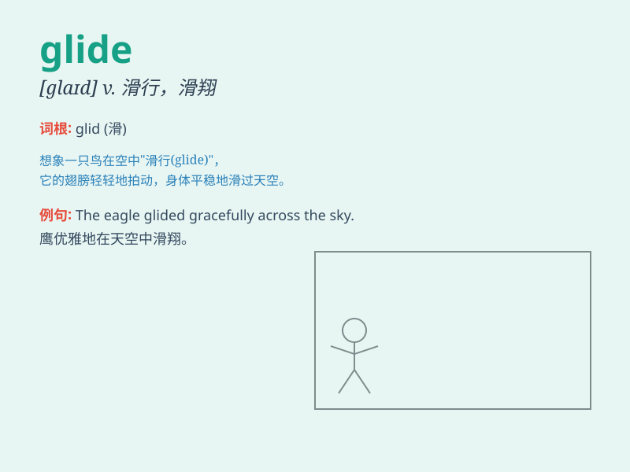

## glide

**英音:** _[glaɪd]_ **美音:** _[ɡlaɪd]_

**译义:** *v.滑行,悄悄地走,(时间)消逝,滑翔n.滑行,滑翔,滑移,滑音*

### 短语

+ **glide path:** _下滑道；滑翔道_

+ **glide slope:** _滑翔斜率；下滑坡度_

+ **glide on:** _在\...\...上滑行_

+ **glide over:** _略过；轻轻滑过_

+ **smooth glide:** _平稳滑行_

### 例句

#### 例句1

> **The swan glided gracefully across the lake.**

**中文翻译:** 这只天鹅优雅地滑过湖面。

**单词释义:** 滑行；滑动

#### 例句2

> **The plane glided smoothly through the air.**

**中文翻译:** 飞机在空中平稳地滑翔。

**单词释义:** 滑翔；滑行

#### 例句3

> **She glided effortlessly through the crowded room.**

**中文翻译:** 她毫不费力地穿过拥挤的房间。

**单词释义:** 轻松地移动；滑行

### 背诵小故事

> A bird was gliding smoothly through the sky. It didn\'t flap its
wings but moved effortlessly, as if dancing in the air. The way it
glided was so graceful and peaceful, like a silent dream.

**一只鸟在天空中平稳地滑翔。它没有扇动翅膀，却毫不费力地移动，仿佛在空中跳舞。它滑翔的方式是如此优雅和平静，就像一个无声的梦。**

### 图义

