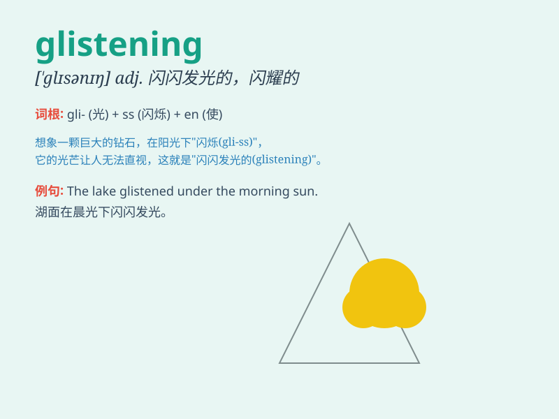

## glistening

**英音:** _[ˈɡlɪslɪŋ]_ **美音:** _[ˈɡlɪs.lɪŋ]_

**译义:** *adj. 发光的；闪亮的；v. 发出光辉（glisten的ing形式）*

### 短语

+ **glistening eyes:** _闪闪发光的眼睛_

+ **glistening surface:** _闪闪发光的表面_

+ **glistening dew:** _闪闪发光的露珠_

+ **glistening jewels:** _闪闪发光的珠宝_

+ **glistening stars:** _闪闪发光的星星_

### 例句

#### 例句1

> **The glistening dewdrops on the grass caught my eye.**

**中文翻译:** 草上闪闪发光的露珠吸引了我的目光。

**单词释义:** 闪闪发光的

#### 例句2

> **Her eyes were glistening with excitement.**

**中文翻译:** 她兴奋得眼睛闪闪发光。

**单词释义:** 闪闪发光的

#### 例句3

> **The glistening surface of the lake looked beautiful under the
moonlight.**

**中文翻译:** 月光下，湖面波光粼粼，看起来很美。

**单词释义:** 闪闪发光的；反光的

### 背诵小故事

> One night, I was walking by the lake. The moon was shining, and its
light reflected on the water, creating a glistening scene. The surface
of the lake seemed to be covered with diamonds, twinkling and beautiful.

**一天晚上，我在湖边散步。月亮照耀着，月光在水面上反射，形成了闪闪发光的景象。湖面似乎覆盖着钻石，闪烁着，美丽极了。**

### 图义

