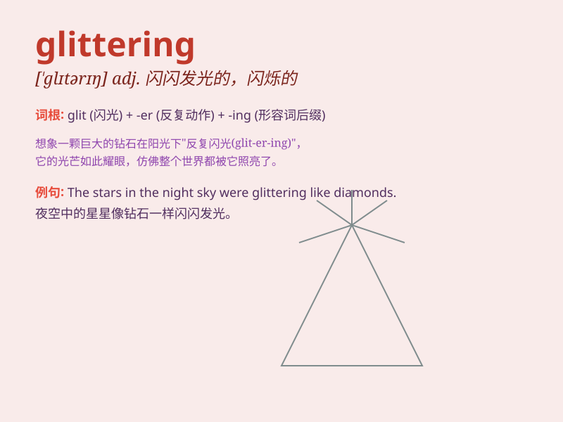

## glittering

**英音:** _[ˈglɪtərɪŋ]_ **美音:** _[ˈglɪtərɪŋ]_

**译义:** *adj.闪烁的，闪耀的；灿烂的，辉煌的；引人注目的，显赫的*

### 短语

+ **glittering career:** _辉煌的事业_

+ **glittering jewels:** _闪闪发光的珠宝_

+ **glittering performance:** _出色的表现_

+ **glittering stars:** _闪烁的星星_

+ **glittering future:** _光明的未来_

### 例句

#### 例句1

> **The stars were glittering in the clear night sky.**

**中文翻译:** 星星在晴朗的夜空中闪闪发光。

**单词释义:** 闪闪发光

#### 例句2

> **She wore a glittering diamond necklace to the party.**

**中文翻译:** 她戴着一条闪闪发光的钻石项链去参加聚会。

**单词释义:** 闪闪发光的

#### 例句3

> **The glittering lights of the city made it look magical.**

**中文翻译:** 城市里闪闪发光的灯光使它看起来很神奇。

**单词释义:** 闪闪发光的

### 背诵小故事

> A prince entered a cave filled with jewels. The jewels were
glittering so brightly that it almost blinded him. He knew these
glittering treasures would bring great wealth and joy to his kingdom.

**一位王子走进一个满是珠宝的洞穴。珠宝闪闪发光，亮得几乎让他睁不开眼。他知道这些闪闪发光的财宝会给他的王国带来巨大的财富和欢乐。**

### 图义

