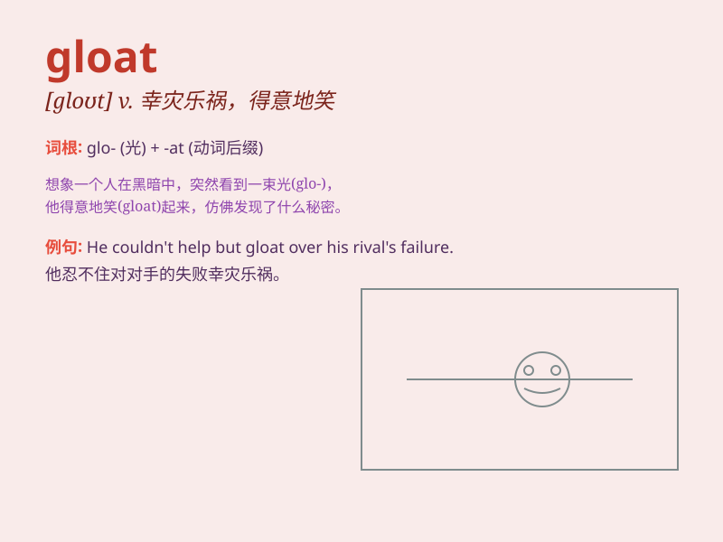

## gloat

**英音:** _[gləʊt]_ **美音:** _[ɡlot]_

**译义:** *v.心满意足*

### 短语

+ **gloat over:** _对\...幸灾乐祸_

+ **gloat at:** _对\...沾沾自喜_

+ **gloat about:** _对\...洋洋自得_

+ **gloat on:** _因\...而自鸣得意_

+ **gloat with:** _带着\...得意_

### 例句

#### 例句1

> **He\'s always gloating over his success and making others feel
bad.**

**中文翻译:** 他总是对自己的成功沾沾自喜，让别人感觉不好。

**单词释义:** 因得意而沾沾自喜

#### 例句2

> **Don\'t gloat when your competitor fails; it\'s
unprofessional.**

**中文翻译:** 当你的竞争对手失败时不要幸灾乐祸，这是不专业的。

**单词释义:** 幸灾乐祸

#### 例句3

> **She sat there gloating about her new promotion.**

**中文翻译:** 她坐在那里为自己的新晋升而洋洋自得。

**单词释义:** 洋洋自得

### 背诵小故事

> A thief stole a precious necklace and gloat about it. But soon the
police caught him. He shouldn\'t have gloated as justice always
prevails.

**一个小偷偷了一条珍贵的项链并沾沾自喜。但很快警察就抓住了他。他不应该沾沾自喜，因为正义总是会获胜。**

### 图义

