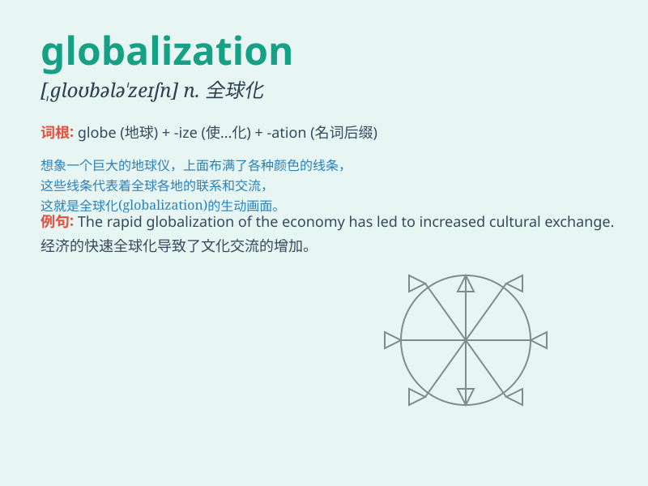

## globalization

**英音:** _[ˌɡləʊbəlaɪˈzeɪʃn]_ **美音:**
_[ˌɡloʊbələˈzeɪʃn]_

**译义:** *n.全球化,全球性*

### 短语

+ **economic globalization:** _经济全球化_

+ **cultural globalization:** _文化全球化_

+ **globalization process:** _全球化进程_

+ **reverse globalization:** _逆全球化_

+ **globalization trend:** _全球化趋势_

### 例句

#### 例句1

> **Globalization has brought about significant changes in the world
economy.**

**中文翻译:** 全球化给世界经济带来了重大的变化。

**单词释义:** 全球化

#### 例句2

> **The negative effects of globalization cannot be ignored.**

**中文翻译:** 全球化的负面影响不容忽视。

**单词释义:** 全球化

#### 例句3

> **We need to find a balance in the process of globalization.**

**中文翻译:** 我们需要在全球化进程中找到平衡。

**单词释义:** 全球化

### 背诵小故事

>
想象一个巨大的地球村，人们轻松地跨越国界交流。商品在世界各地自由流通，文化相互融合。这就是
globalization 的景象，整个地球如同一个紧密相连的大家庭。

**想象一个巨大的地球村，人们轻松跨越国界交流，商品自由流通，文化相互融合，这就是全球化的景象，整个地球如同紧密相连的大家庭。**

### 图义

