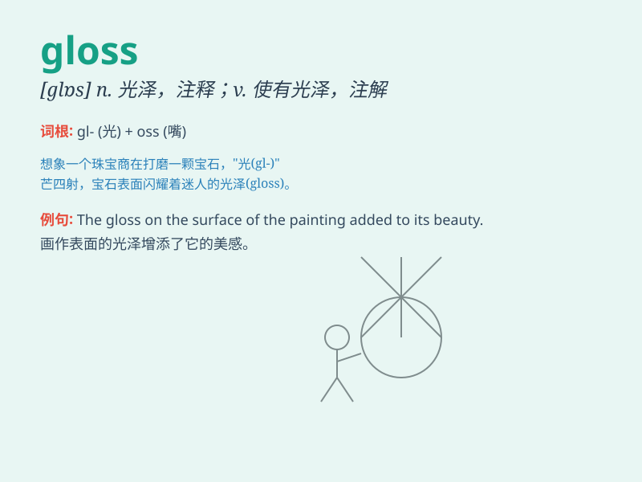

## gloss

**英音:** _[glɒs]_ **美音:** _[ɡlɑs]_

**译义:**
*n.光泽的表面,光彩,欺人的表面,假象,注释vt.使有光彩,掩饰,上光于,注释,曲解vi.发光,作注释*

### 短语

+ **gloss over:** _轻描淡写；掩盖；掩饰_

+ **lip gloss:** _唇彩_

+ **gloss finish:** _光泽面；光泽处理_

+ **gloss paint:** _有光泽的油漆_

+ **hair gloss:** _头发光泽剂_

### 例句

#### 例句1

> **She applied a gloss to her lips before going on stage.**

**中文翻译:** 上台前，她在嘴唇上涂了唇彩。

**单词释义:** 亮光，光泽

#### 例句2

> **The car\'s paint had a high gloss finish.**

**中文翻译:** 该车的油漆具有高光泽度。

**单词释义:** 光泽

#### 例句3

> **He tried to gloss over his mistakes.**

**中文翻译:** 他试图掩盖自己的错误。

**单词释义:** 掩饰，粉饰

### 背诵小故事

>
想象一下，一个画家正在给一幅画涂上一层光亮的涂料（gloss），这层涂料让画面变得更加亮丽和吸引人。就像这个单词本身，有着光泽、光彩的意思。

**想象画家给画涂光亮涂料来辅助记忆【gloss】有光泽、光彩的意思**

### 图义

