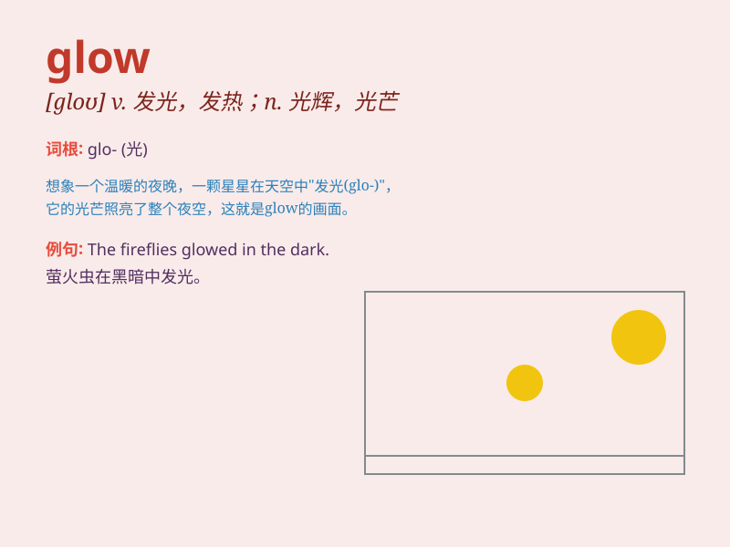

## glow

**英音:** _[gləʊ]_ **美音:** _[ɡlo]_

**译义:** *vi.发光,发热*

### 短语

+ **glow with pride:** _因骄傲而容光焕发_

+ **glow in the dark:** _在黑暗中发光_

+ **take on a glow:** _呈现出光辉_

+ **a soft glow:** _柔和的光芒_

+ **the glow of dawn:** _黎明的曙光_

### 例句

#### 例句1

> **The fireflies were glowing in the dark forest.**

**中文翻译:** 萤火虫在黑暗的森林里闪闪发光。

**单词释义:** 发光

#### 例句2

> **Her face had a healthy glow after the exercise.**

**中文翻译:** 运动后，她的脸焕发出健康的光泽。

**单词释义:** 红润；容光焕发

#### 例句3

> **The embers still glowed in the fireplace.**

**中文翻译:** 壁炉里的余烬仍然在发光。

**单词释义:** 发出微弱而稳定的光；发热

### 背诵小故事

> In the cold winter night, a little girl was lost in the forest.
Suddenly, she saw a lantern glowing in the distance. The warm glow
guided her home safely. The lantern\'s glow gave her hope and courage.

**在寒冷的冬夜，一个小女孩在森林里迷路了。突然，她看到远处有一盏灯笼在发光。温暖的光芒引导她安全回家。灯笼的光亮给了她希望和勇气。**

### 图义

