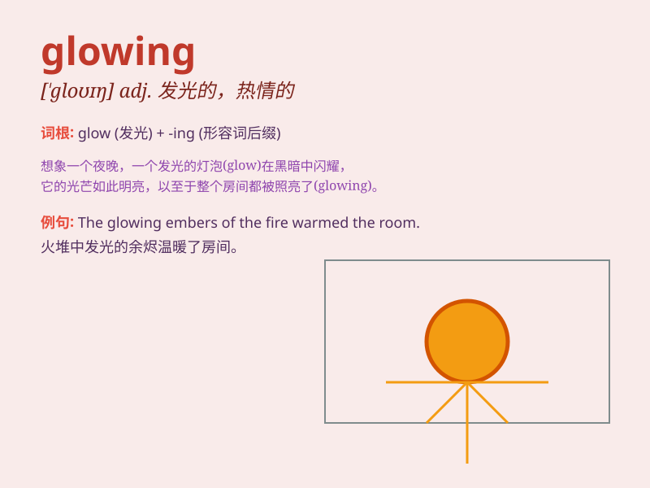

## glowing

**英音:** _[ˈɡləʊɪŋ]_ **美音:** _[ˈɡloʊɪŋ]_

**译义:** *adj.炽热的,容光焕发的,生气勃勃的*

### 短语

+ **glowing praise:** _热烈的赞扬_

+ **glowing complexion:** _容光焕发的面色_

+ **glowing embers:** _灼热的余烬_

+ **glowing report:** _热情洋溢的报告_

+ **glowing sunset:** _绚丽的日落_

### 例句

#### 例句1

> **The reviews for her new book were glowing.**

**中文翻译:** 她的新书的评论很热烈。

**单词释义:** 热情赞扬的

#### 例句2

> **She had a glowing complexion.**

**中文翻译:** 她肤色容光焕发。

**单词释义:** 容光焕发的；红润的

#### 例句3

> **The fire gave a glowing light.**

**中文翻译:** 火发出耀眼的光芒。

**单词释义:** 炽热的；灼热的

### 背诵小故事

> A girl was lost in the forest at night. Suddenly, she saw a glowing
lantern. It led her to a warm cabin. The lantern\'s glowing light gave
her hope and guided her safely.

**一个女孩在夜晚迷失在森林里。突然，她看到一盏发光的灯笼。它把她引向一个温暖的小屋。灯笼的光芒给了她希望，并安全地引导她。**

### 图义

