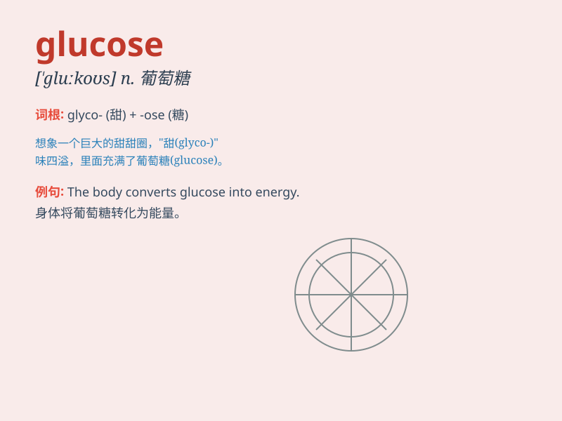

## glucose

**英音:** _[\'gluːkəʊs; -z]_ **美音:** _[\'ɡlukos]_

**译义:** *n.葡萄糖*

### 短语

+ **blood glucose:** _血糖_

+ **glucose level:** _葡萄糖水平_

+ **glucose metabolism:** _葡萄糖代谢_

+ **glucose tolerance:** _葡萄糖耐量_

+ **glucose solution:** _葡萄糖溶液_

### 例句

#### 例句1

> **The doctor measured the patient\'s glucose level.**

**中文翻译:** 医生测量了病人的血糖水平。

**单词释义:** 葡萄糖

#### 例句2

> **Glucose is an important source of energy for the body.**

**中文翻译:** 葡萄糖是身体重要的能量来源。

**单词释义:** 葡萄糖

#### 例句3

> **The athlete consumed a drink containing glucose before the
race.**

**中文翻译:** 运动员在比赛前饮用了含有葡萄糖的饮料。

**单词释义:** 葡萄糖

### 背诵小故事

> Imagine a group of little goblins running around with a special kind
of sugar called \'glucose\'. They use it to power their magic lamps.
This sugar gives them energy to play and have fun. So, remember, glucose
is that important sugar that gives energy!

**想象一群小妖精拿着一种特殊的糖跑来跑去，这种糖叫做'葡萄糖'。他们用它来为他们的魔法灯提供能量。这种糖给他们提供玩耍和娱乐的能量。所以，记住，葡萄糖是提供能量的重要的糖！**

### 图义

