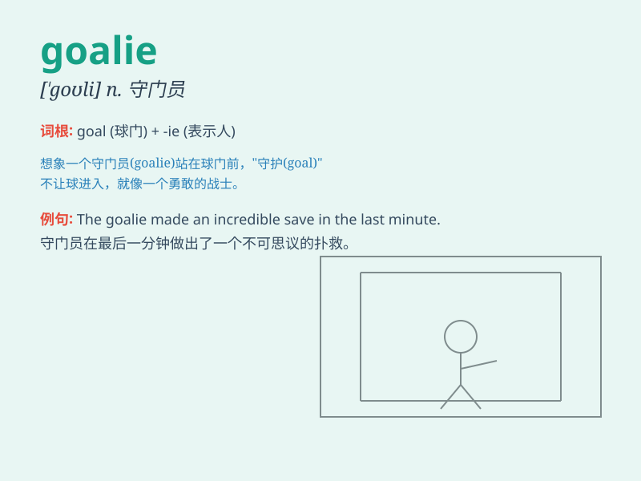

## goalie

**英音:** _[\'gəʊlɪ]_ **美音:** _[\'goli]_

**译义:** *n.守门员*

### 短语

+ **football goalie:** _足球守门员_

+ **ice hockey goalie:** _冰球守门员_

+ **star goalie:** _明星守门员_

+ **experienced goalie:** _经验丰富的守门员_

+ **backup goalie:** _替补守门员_

### 例句

#### 例句1

> **The goalie made a brilliant save to deny the opposing team a
goal.**

**中文翻译:** 守门员做出了一次精彩的扑救，阻止了对方球队进球。

**单词释义:** 守门员

#### 例句2

> **The new goalie is still adjusting to the team\'s playing
style.**

**中文翻译:** 这位新守门员仍在适应球队的比赛风格。

**单词释义:** 守门员

#### 例句3

> **The goalie was injured during the match and had to be
replaced.**

**中文翻译:** 守门员在比赛中受伤了，不得不被替换。

**单词释义:** 守门员

### 背诵小故事

> In a crucial football match, the team was in danger. But our brave
goalie stood firm like a warrior. He blocked every shot, saving the
team. Remember, a goalie is the hero who guards the goal!

**在一场关键的足球比赛中，球队处于危险之中。但我们勇敢的守门员像战士一样坚定地站着。他挡住了每一次射门，拯救了球队。记住，守门员就是守卫球门的英雄！**

### 图义

