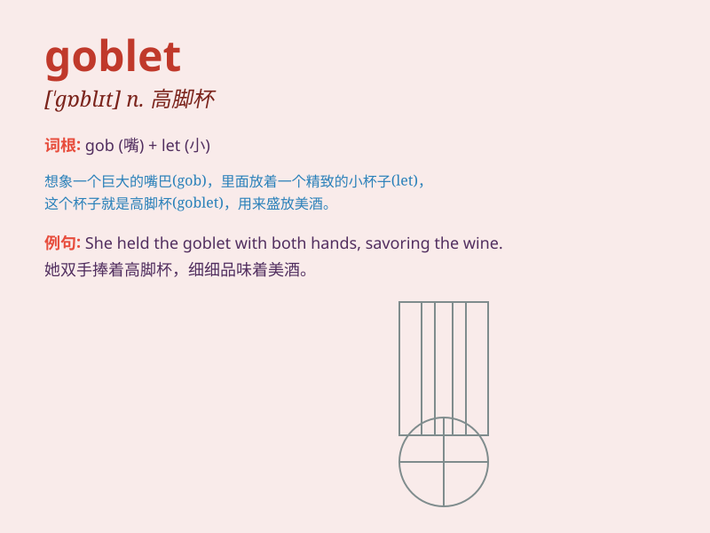

## goblet

**英音:** _[\'gɒblɪt]_ **美音:** _[\'ɡɑblət]_

**译义:** *n.高脚玻璃杯,酒杯*

### 短语

+ **wine goblet:** _葡萄酒杯_

+ **crystal goblet:** _水晶高脚杯_

+ **golden goblet:** _金质高脚杯_

+ **engraved goblet:** _雕刻的高脚杯_

+ **silver goblet:** _银质高脚杯_

### 例句

#### 例句1

> **He raised the goblet and toasted to the success of the
project.**

**中文翻译:** 他举起高脚杯，为项目的成功干杯。

**单词释义:** 高脚杯

#### 例句2

> **The goblet on the table was made of crystal.**

**中文翻译:** 桌子上的高脚杯是水晶做的。

**单词释义:** 高脚杯

#### 例句3

> **She carefully filled the goblet with wine.**

**中文翻译:** 她小心地往高脚杯里倒酒。

**单词释义:** 高脚杯

### 背诵小故事

> A brave knight was on a quest. In a hidden cave, he found a magical
goblet. It sparkled and seemed to hold a secret power. The knight knew
this goblet was a precious find.

**一位勇敢的骑士正在探险。在一个隐藏的洞穴里，他发现了一个神奇的高脚杯。它闪闪发光，似乎拥有神秘的力量。骑士知道这个高脚杯是珍贵的发现。**

### 图义

