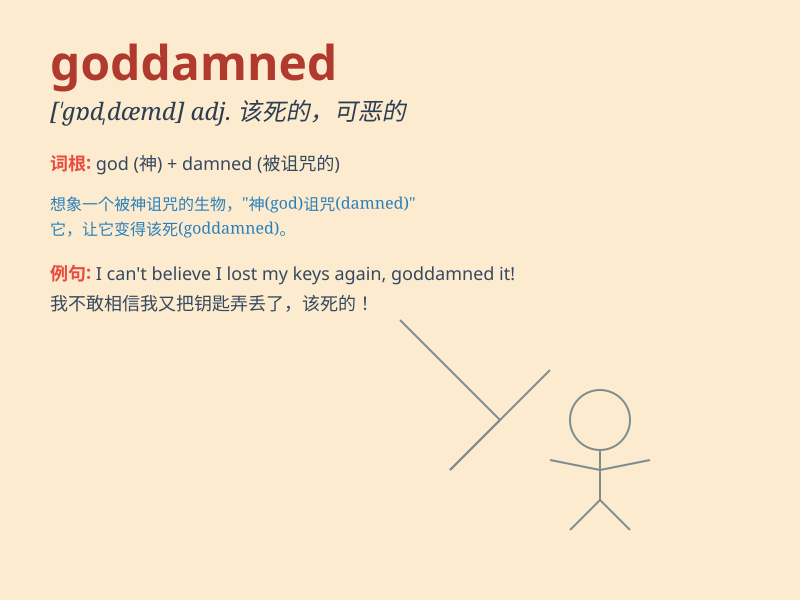

## goddamned

**英音:** _[ˈgɒdˈdæmd]_ **美音:** _[ˈgɑdˌdæmd]_

**译义:** *adj.(受)诅咒的,讨厌的*

### 短语

+ **goddamned liar:** _该死的骗子_

+ **goddamned job:** _讨厌的工作_

+ **goddamned weather:** _该死的天气_

+ **goddamned mess:** _可恶的混乱_

+ **goddamned problem:** _讨厌的问题_

### 例句

#### 例句1

> **This goddamned computer keeps crashing!**

**中文翻译:** 这该死的电脑老是死机！

**单词释义:** 该死的；讨厌的（用于加强语气，表示愤怒或厌烦）

#### 例句2

> **I can\'t find my goddamned keys.**

**中文翻译:** 我找不到我那该死的钥匙。

**单词释义:** 该死的；讨厌的（加强语气）

#### 例句3

> **Why did you do that goddamned thing?**

**中文翻译:** 你为什么做那件该死的事？

**单词释义:** 该死的；可恶的（表达生气）

### 背诵小故事

> A man was lost in a forest and encountered many difficulties. He
shouted, \'This goddamned forest! Why can\'t I find my way out?\' Here,
\'goddamned\' expresses his extreme annoyance and frustration.

**一个男人在森林里迷路了，遭遇了很多困难。他大喊：'这该死的森林！我怎么就找不到出去的路？'
在这里，'goddamned'表达了他极度的恼怒和沮丧。**

### 图义

