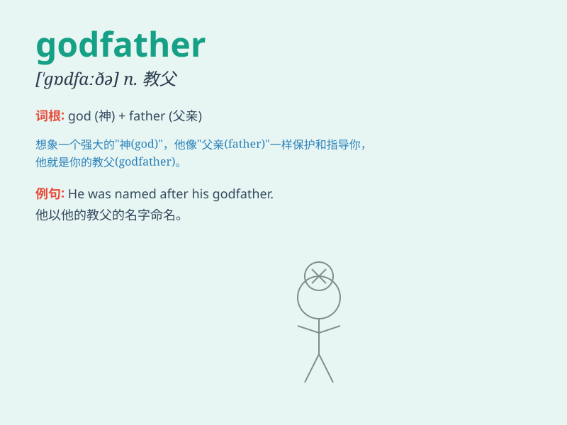

## godfather

**英音:** _[\'gɒdfɑːθə]_ **美音:** _[\'ɡɑdfɑðɚ]_

**译义:** *n.教父vt.当教父*

### 短语

+ **crime godfather:** _犯罪教父_

+ **movie godfather:** _电影《教父》_

+ **political godfather:** _政治教父_

+ **business godfather:** _商业教父_

+ **music godfather:** _音乐教父_

### 例句

#### 例句1

> **He is considered the godfather of modern jazz.**

**中文翻译:** 他被认为是现代爵士乐的教父。

**单词释义:**
在这个句子中，\'godfather\'指的是在某个领域具有开创性和极大影响力的人物。

#### 例句2

> **The godfather of the crime family was finally arrested.**

**中文翻译:** 这个犯罪家族的教父最终被逮捕了。

**单词释义:** 这里的\'godfather\'指的是犯罪集团的首领或头目。

#### 例句3

> **The movie \'The Godfather\' is a classic.**

**中文翻译:** 电影《教父》是一部经典之作。

**单词释义:** 此处\'Godfather\'是电影的名称，指特定的作品。

### 背诵小故事

> A young man was in trouble. A mysterious old man appeared and helped
him. Later, the young man found out the old man was a godfather, a
powerful and respected figure. The godfather had the ability to solve
any problem.

**一个年轻人陷入了困境。一位神秘的老人出现并帮助了他。后来，年轻人发现这位老人是教父，一个强大且受人尊敬的人物。教父有能力解决任何问题。**

### 图义

