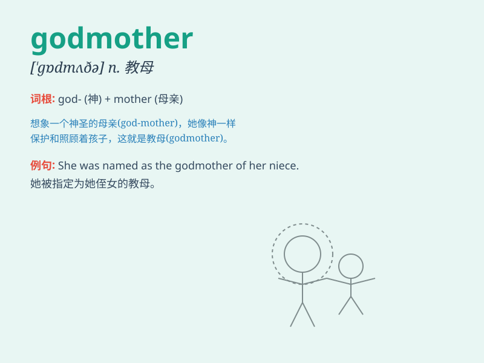

## godmother

**英音:** _[\'gɒdmʌθə]_ **美音:** _[\'ɡɑdmʌðɚ]_

**译义:** *n.教母,名义上母亲*

### 短语

+ **fairy godmother:** _（危难时提供及时帮助的）女恩人，女救星_

+ **godmother of something:**
_某事物的女赞助者；某事物的女发起者_

+ **honorary godmother:** _名誉教母_

+ **spiritual godmother:** _精神教母_

+ **godmother figure:** _教母般的人物_

### 例句

#### 例句1

> **My godmother gave me a beautiful dress on my birthday.**

**中文翻译:** 我的教母在我生日时给了我一条漂亮的裙子。

**单词释义:** 教母

#### 例句2

> **She has always been like a godmother to me, offering support and
advice.**

**中文翻译:** 她一直像我的教母一样，给我提供支持和建议。

**单词释义:** 教母

#### 例句3

> **The godmother of the princess was a powerful and wise woman.**

**中文翻译:** 公主的教母是一位有权势且睿智的女人。

**单词释义:** 教母

### 背诵小故事

> Once upon a time, a little girl was lost and scared. Then a kind
woman appeared and helped her. The girl called the woman her godmother.
The godmother took care of her and made her feel safe and loved.

**从前，有个小女孩迷路了很害怕。然后一位善良的女士出现并帮助了她。小女孩称这位女士为教母。教母照顾她，让她感到安全和被爱。**

### 图义

