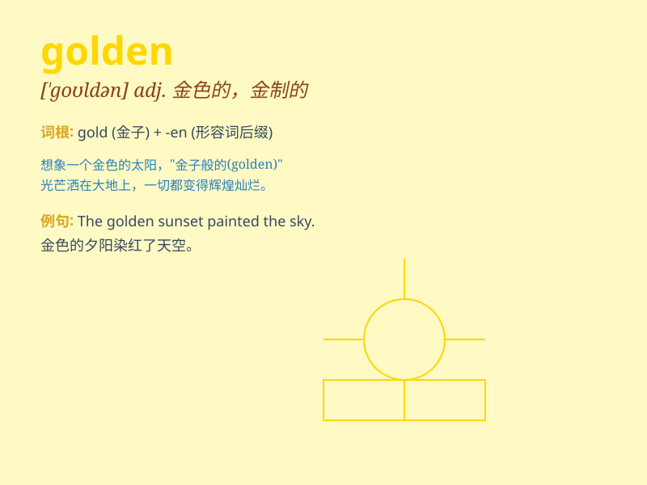

## golden

**英音:** _[ˈgəʊldən]_ **美音:** _[ˈɡoldn]_

**译义:** *adj.金色的,金黄色的,贵重的,极好的,黄金的*

### 短语

+ **golden age:** _黄金时代；鼎盛时期_

+ **golden rule:** _重要原则；金科玉律_

+ **golden opportunity:** _绝好的机会；良机_

+ **golden mean:** _中庸之道；黄金分割_

+ **golden handshake:** _解雇金；退职金_

### 例句

#### 例句1

> **The golden sun was setting over the mountains.**

**中文翻译:** 金色的太阳正在山上落下。

**单词释义:** 金色的

#### 例句2

> **She has a golden opportunity to study abroad.**

**中文翻译:** 她有一个出国留学的千载难逢的机会。

**单词释义:** 极好的；珍贵的

#### 例句3

> **The couple celebrated their golden wedding anniversary last
year.**

**中文翻译:** 这对夫妇去年庆祝了金婚纪念日。

**单词释义:** 金质的；五十周年的

### 背诵小故事

> Once upon a time, there was a magical tree with golden apples.
Everyone wanted them because they were so shiny and precious. The golden
color made the apples stand out and be highly desired.

**从前，有一棵神奇的树，上面长满了金苹果。每个人都想要它们，因为它们是如此闪亮和珍贵。金色让这些苹果格外引人注目，令人向往。**

### 图义

