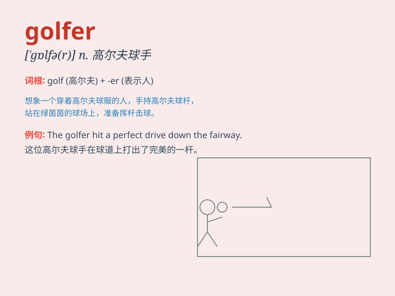

## golfer

**英音:** _[\'gɒlfə]_ **美音:** _[\'ɡɑlfɚ]_

**译义:** *n.打高尔夫球的人*

### 短语

+ **professional golfer:** _职业高尔夫球手_

+ **amateur golfer:** _业余高尔夫球手_

+ **skilled golfer:** _技术娴熟的高尔夫球手_

+ **female golfer:** _女高尔夫球手_

+ **beginner golfer:** _高尔夫球新手_

### 例句

#### 例句1

> **The golfer hit a perfect drive off the tee.**

**中文翻译:** 高尔夫球手从发球台上打出了完美的开球。

**单词释义:** 高尔夫球手

#### 例句2

> **She is a professional golfer and has won many championships.**

**中文翻译:** 她是一名职业高尔夫球手，赢得了许多冠军。

**单词释义:** 高尔夫球手

#### 例句3

> **The young golfer showed great potential in the tournament.**

**中文翻译:** 这位年轻的高尔夫球手在比赛中展现出了巨大的潜力。

**单词释义:** 高尔夫球手

### 背诵小故事

> Once upon a time, there was a young man named Tom. He loved sports
and spent most of his time on the golf course. Day after day, he
practiced hard and finally became a skilled golfer. Now, everyone knew
him as the best golfer in town.

**从前，有个叫汤姆的年轻人。他热爱运动，大部分时间都在高尔夫球场上。日复一日，他努力练习，最终成为了一名技术娴熟的高尔夫球手。现在，每个人都知道他是镇上最好的高尔夫球手。**

### 图义

