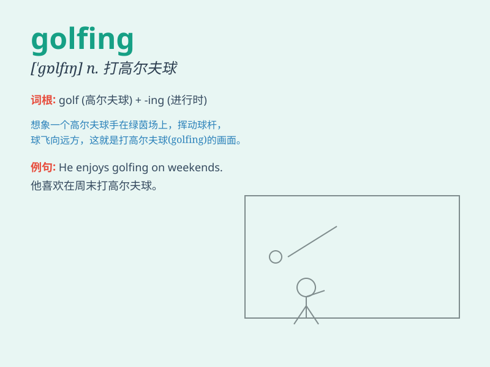

## golfing

**英音:** _[ˈɡɒlfɪŋ]_ **美音:** _[ˈɡɔːlfɪŋ]_

**译义:** *n.打高尔夫球*

### 短语

+ **golfing vacation:** _高尔夫度假_

+ **golfing equipment:** _高尔夫装备_

+ **golfing tournament:** _高尔夫锦标赛_

+ **golfing partner:** _高尔夫球伙伴_

+ **golfing course:** _高尔夫球场_

### 例句

#### 例句1

> **I enjoy golfing on weekends.**

**中文翻译:** 我喜欢在周末打高尔夫球。

**单词释义:** 打高尔夫球（动名词形式）

#### 例句2

> **He is passionate about golfing and spends a lot of time on
it.**

**中文翻译:** 他热衷于打高尔夫球，并在这上面花费了很多时间。

**单词释义:** 打高尔夫球（动名词形式）

#### 例句3

> **Golfing can be a great way to relax and socialize.**

**中文翻译:** 打高尔夫球可以是一种很好的放松和社交的方式。

**单词释义:** 打高尔夫球（动名词形式）

### 背诵小故事

> One day, Tom was very excited because he was going golfing. He put on
his special shoes and carried his club. He hit the ball hard and had a
great time on the golf course. Golfing made him feel relaxed and happy.

**有一天，汤姆非常兴奋，因为他要去打高尔夫球。他穿上特制的鞋子，拿着球杆。他用力击球，在高尔夫球场上度过了一段美好的时光。打高尔夫球让他感到放松和快乐。**

### 图义

