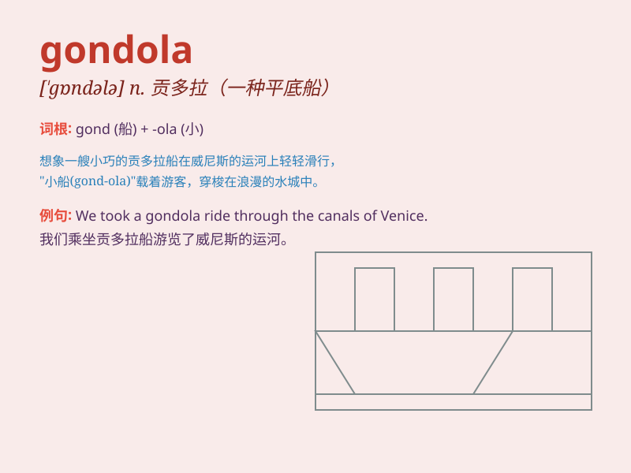

## gondola

**英音:** _[\'gɒndələ]_ **美音:** _[\'ɡɑndələ]_

**译义:** *n.狭长小船,两头尖的平底船,无盖货车*

### 短语

+ **gondola lift:** _贡多拉式缆车_

+ **gondola car:** _无盖货车_

+ **gondola ride:** _乘坐贡多拉_

+ **gondola window:** _贡多拉式窗户_

+ **gondola station:** _贡多拉车站_

### 例句

#### 例句1

> **We took a gondola ride through the canals of Venice.**

**中文翻译:** 我们乘坐贡多拉穿过威尼斯的运河。

**单词释义:** 贡多拉（一种狭长的平底船）

#### 例句2

> **The gondola was beautifully decorated with flowers.**

**中文翻译:** 贡多拉用鲜花装饰得很漂亮。

**单词释义:** 贡多拉

#### 例句3

> **She sat in the gondola, enjoying the view along the river.**

**中文翻译:** 她坐在缆车里，欣赏着河边的景色。

**单词释义:** 贡多拉

### 背诵小故事

> Once upon a time, a couple took a romantic ride in a gondola on a
beautiful river. The gondola, a long and narrow boat, gently glided
through the water. They enjoyed the peaceful moment together.

**从前，有一对情侣在一条美丽的河上乘着贡多拉进行了一次浪漫的旅行。贡多拉，这种又长又窄的船，轻轻地在水面滑行。他们一起享受了这宁静的时刻。**

### 图义

