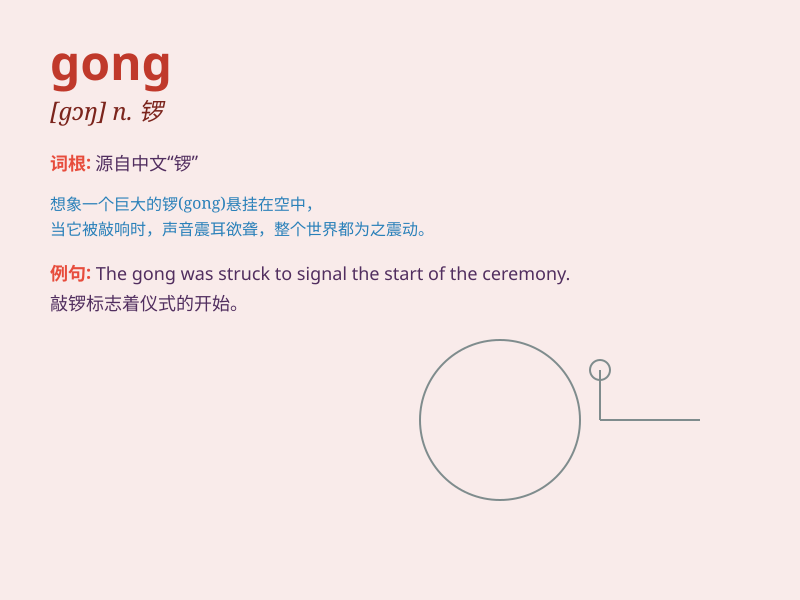

## gong

**英音:** _[gɒŋ]_ **美音:** _[ɡɑŋ]_

**译义:** *n.铜锣,盘形钟vt.打锣作为停车信号*

### 短语

+ **gong bell:** _铜锣_

+ **gong show:** _宣传性的表演_

+ **metal gong:** _金属锣_

+ **wind gong:** _风锣_

+ **gong strike:** _敲锣_

### 例句

#### 例句1

> **The gong sounded to announce the start of the ceremony.**

**中文翻译:** 锣声响起，宣告仪式开始。

**单词释义:** 锣

#### 例句2

> **He hit the gong with a mallet.**

**中文翻译:** 他用木槌敲锣。

**单词释义:** 锣

#### 例句3

> **The gong was placed in the corner of the room.**

**中文翻译:** 锣放在房间的角落里。

**单词释义:** 锣

### 背诵小故事

> Once upon a time, a brave knight hit a gong to warn the villagers of
an approaching danger. The loud sound of the gong echoed through the
valley. With its unique ring, the word \'gong\' was easy to remember.

**从前，一位勇敢的骑士敲响了一面锣来警告村民即将到来的危险。锣的响亮声音在山谷中回荡。凭借其独特的响声，单词\'gong\'很容易被记住。**

### 图义

