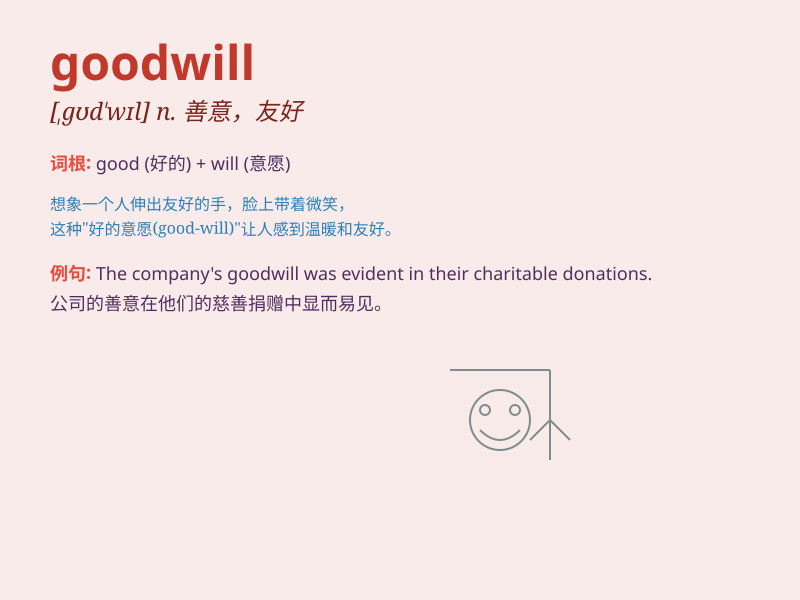

## goodwill

**英音:** _[gʊd\'wɪl]_ **美音:** _[\'gʊd\'wɪl]_

**译义:** *n.善意,亲切*

### 短语

+ **goodwill gesture:** _友好的表示；善意的姿态_

+ **goodwill message:** _友好的信息；善意的消息_

+ **goodwill ambassador:** _亲善大使_

+ **trade goodwill:** _商业信誉_

+ **accumulate goodwill:** _积累善意；积累好感_

### 例句

#### 例句1

> **The company has built up a lot of goodwill over the years.**

**中文翻译:** 这家公司多年来树立了良好的声誉。

**单词释义:** 友好；善意；信誉

#### 例句2

> **They showed goodwill towards their neighbors by helping them with
the harvest.**

**中文翻译:** 他们通过帮助邻居收割庄稼来表达对邻居的友好。

**单词释义:** 友好；善意

#### 例句3

> **The merger was facilitated by the goodwill between the two
companies.**

**中文翻译:** 这两家公司之间的友好关系促进了这次合并。

**单词释义:** 友好关系；善意

### 背诵小故事

> A poor man lost his job. But a kind boss showed goodwill by giving
him a new chance. With hard work, the man succeeded and always
remembered the boss\'s kindness. Goodwill means kindness and friendly
intention.

**一个穷人丢了工作。但一位善良的老板展现出善意，给了他一个新机会。通过努力工作，这个人成功了，并一直记得老板的善意。goodwill
意思是善意、友好的意向。**

### 图义

