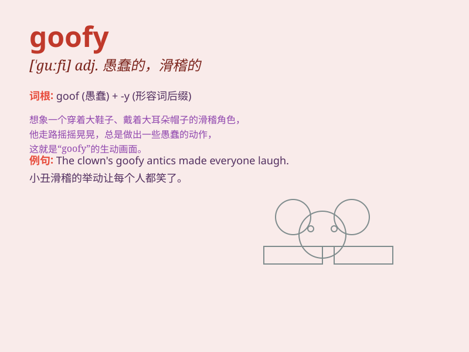

## goofy

**英音:** _[\'guːfɪ]_ **美音:** _[\'ɡufi]_

**译义:** *adj.愚笨的,傻瓜的*

### 短语

+ **goofy smile:** _傻气的笑容_

+ **goofy hat:** _滑稽的帽子_

+ **goofy character:** _愚蠢的角色_

+ **goofy behavior:** _愚蠢的行为_

+ **goofy idea:** _愚蠢的想法_

### 例句

#### 例句1

> **He has a goofy smile on his face.**

**中文翻译:** 他脸上带着傻傻的笑容。

**单词释义:** 傻的；愚蠢的

#### 例句2

> **The goofy hat made him look funny.**

**中文翻译:** 那顶滑稽的帽子让他看起来很有趣。

**单词释义:** 滑稽的；可笑的

#### 例句3

> **Don\'t be so goofy when you\'re in a serious meeting.**

**中文翻译:** 在严肃的会议上别这么傻里傻气的。

**单词释义:** 傻里傻气的

### 背诵小故事

> Once upon a time, there was a clumsy and funny dog named Goofy. He
always did silly things like running into walls and tripping over his
own paws. Everyone laughed at his goofy behavior.

**从前，有一只笨拙又有趣的狗叫高飞。他总是做一些傻乎乎的事情，比如撞墙和被自己的爪子绊倒。大家都因他滑稽的行为大笑。**

### 图义

