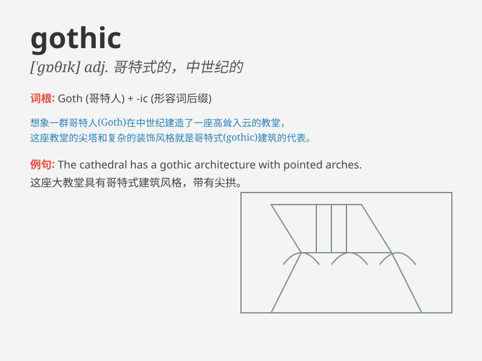

## gothic

**英音:** _[ˈɡɒθɪk]_ **美音:** _[ˈɡɑːθɪk]_

**译义:** *n.哥特式adj.哥特式的,野蛮的*

### 短语

+ **Gothic architecture:** _哥特式建筑_

+ **Gothic novel:** _哥特式小说_

+ **Gothic lettering:** _哥特字体_

+ **Gothic style:** _哥特风格_

+ **Gothic Revival:** _哥特复兴式_

### 例句

#### 例句1

> **The cathedral has a magnificent Gothic architecture.**

**中文翻译:** 这座大教堂有着宏伟的哥特式建筑。

**单词释义:** 哥特式的（形容建筑风格）

#### 例句2

> **She loves reading Gothic novels.**

**中文翻译:** 她喜欢读哥特式小说。

**单词释义:** 哥特式的（形容小说类型）

#### 例句3

> **The movie has a Gothic atmosphere with dark settings.**

**中文翻译:** 这部电影有着哥特式的氛围，场景黑暗。

**单词释义:** 哥特式的（形容氛围）

### 背诵小故事

> A traveler entered an old castle. Its architecture was Gothic. The
pointed arches and dark interiors gave a mysterious feel. He felt as if
time had stopped. Gothic style made a deep impression on him.

**一位旅行者进入了一座古老的城堡。它的建筑是哥特式的。尖尖的拱门和昏暗的内部给人一种神秘的感觉。他觉得仿佛时间都停止了。哥特式风格给他留下了深刻的印象。**

### 图义

