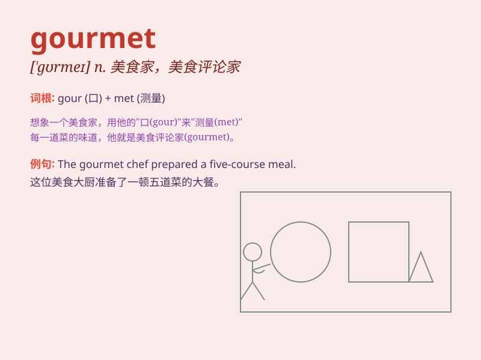

## gourmet

**英音:** _[\'gʊəmeɪ; \'gɔː-]_ **美音:** _[\'ɡʊrme]_

**译义:** *n.能精选品评美食、美洒的人*

### 短语

+ **gourmet food:** _美食；美味食品_

+ **gourmet restaurant:** _美食餐厅；高级餐厅_

+ **gourmet coffee:** _优质咖啡；精品咖啡_

+ **gourmet cooking:** _美食烹饪；高级烹饪_

+ **gourmet chef:** _美食厨师；高级厨师_

### 例句

#### 例句1

> **The gourmet restaurant offers a wide range of exquisite
dishes.**

**中文翻译:** 这家美食餐厅提供各种各样的精致菜肴。

**单词释义:** 美食家；讲究饮食的人

#### 例句2

> **He is a true gourmet, always seeking the best flavors.**

**中文翻译:** 他是一个真正的美食家，总是在寻找最美味的东西。

**单词释义:** 美食家

#### 例句3

> **The gourmet food fair attracted thousands of visitors.**

**中文翻译:** 这个美食节吸引了成千上万的游客。

**单词释义:** 美食的；美味佳肴的

### 背诵小故事

> A chef named Tom was known as a gourmet. He could tell the finest
ingredients with one taste. His passion for exquisite food made him
famous. People came from far to enjoy his gourmet dishes.

**一位名叫汤姆的厨师被认为是美食家。他尝一口就能分辨出最优质的食材。他对精致美食的热爱使他出名。人们从远方赶来品尝他的美食佳肴。**

### 图义

