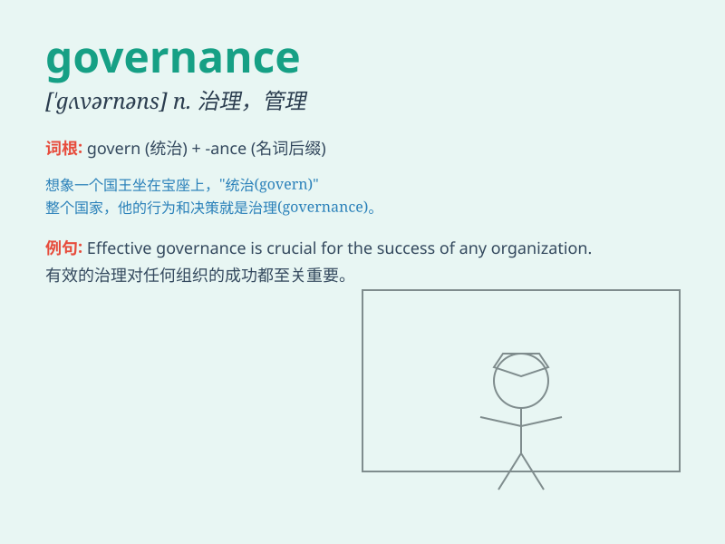

## governance

**英音:** _[\'gʌv(ə)nəns]_ **美音:** _[\'gʌvɚnəns]_

**译义:** *n.统治,管理,统辖*

### 短语

+ **corporate governance:** _公司治理；企业管治_

+ **good governance:** _良好的治理；善治_

+ **democratic governance:** _民主治理_

+ **environmental governance:** _环境治理_

+ **global governance:** _全球治理_

### 例句

#### 例句1

> **Good governance is essential for the development of a
country.**

**中文翻译:** 良好的治理对于一个国家的发展至关重要。

**单词释义:** 治理；管理

#### 例句2

> **The company\'s governance structure needs to be improved.**

**中文翻译:** 这家公司的治理结构需要改进。

**单词释义:** 治理；管理体制

#### 例句3

> **The governance of this school is very strict.**

**中文翻译:** 这所学校的管理非常严格。

**单词释义:** 管理；统治

### 背诵小故事

> Once upon a time, in a kingdom, the wise king established a set of
rules and systems to manage the land and people. This process was called
governance. It made everything orderly and prosperous.

**从前，在一个王国里，睿智的国王建立了一套规则和制度来管理土地和人民。这个过程被称为治理。它让一切变得有序和繁荣。**

### 图义

