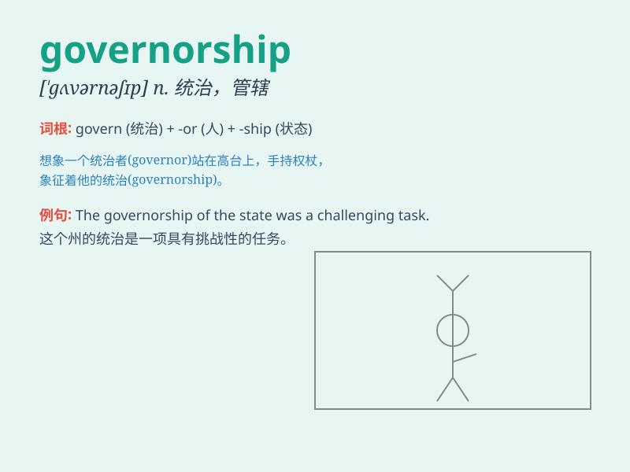

## governorship

**英音:** _[ˈgʌvənəʃɪp]_ **美音:** _[ˈgʌvərnərˌʃɪp]_

**译义:** *n.总督(或州长等地方行政长官)的职位(或职责、任期)*

### 短语

+ **run for governorship:** _竞选州长职位_

+ **assume the governorship:** _担任州长一职_

+ **resign from the governorship:** _从州长职位上辞职_

+ **electoral governorship:** _选举产生的州长职位_

+ **incumbent governorship:** _现任州长职位_

### 例句

#### 例句1

> **He is running for the governorship of the state.**

**中文翻译:** 他正在竞选这个州的州长职位。

**单词释义:** 州长职位

#### 例句2

> **The governorship has brought him great responsibility.**

**中文翻译:** 州长的职务给他带来了巨大的责任。

**单词释义:** 州长的职务

#### 例句3

> **After years of hard work, she finally won the governorship.**

**中文翻译:** 经过多年的努力，她终于赢得了州长一职。

**单词释义:** 州长一职

### 背诵小故事

> A brave man desired to obtain the governorship. He faced many
challenges but with wisdom and kindness, he finally achieved it and led
the region to prosperity.

**一位勇敢的人渴望获得州长职位。他面临诸多挑战，但凭借智慧和善良，最终成功并带领该地区走向繁荣。**

### 图义

