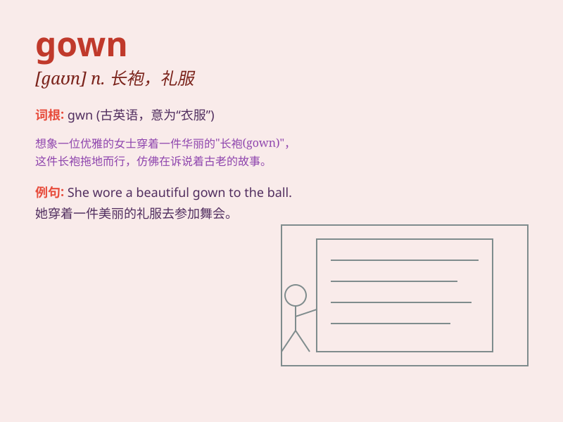

## gown

**英音:** _[gaʊn]_ **美音:** _[ɡaʊn]_

**译义:** *n.长袍,法衣,礼服,睡袍*

### 短语

+ **wedding gown:** _婚纱_

+ **evening gown:** _晚礼服_

+ **hospital gown:** _病号服_

+ **ball gown:** _舞会礼服_

+ **bridal gown:** _新娘礼服_

### 例句

#### 例句1

> **The bride wore a beautiful white gown at the wedding.**

**中文翻译:** 新娘在婚礼上穿着一件漂亮的白色礼服。

**单词释义:** 礼服

#### 例句2

> **She put on her evening gown to attend the party.**

**中文翻译:** 她穿上她的晚礼服去参加聚会。

**单词释义:** 晚礼服

#### 例句3

> **The doctor wore a surgical gown during the operation.**

**中文翻译:** 医生在手术期间穿着手术服。

**单词释义:** 长袍；罩衣

### 背诵小故事

> A beautiful princess was getting ready for a grand ball. Her maid
brought her a stunning gown. It was long, flowing, and had shiny pearls.
The princess wore the gown and looked like a fairy.

**一位美丽的公主正在为一场盛大的舞会做准备。她的女仆给她带来了一件令人惊叹的长袍。它又长又飘逸，还有闪亮的珍珠。公主穿上这件长袍，看起来像个仙女。**

### 图义

