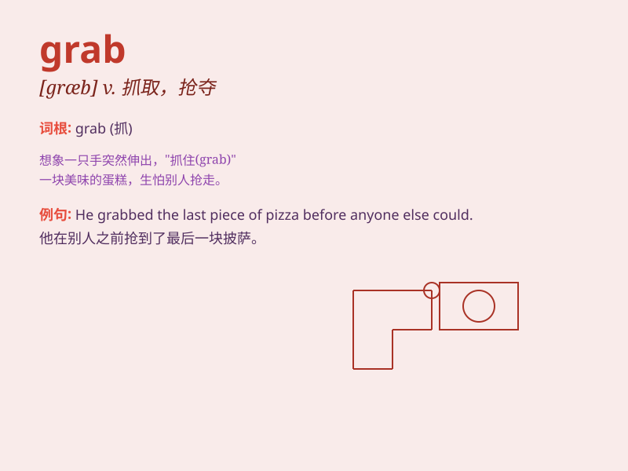

## grab

**英音:** _[græb]_ **美音:** _[ɡræb]_

**译义:** *v.抢夺,攫取,夺取*

### 短语

+ **grab a bite:** _随便吃点东西_

+ **grab hold of:** _抓住，握住_

+ **grab attention:** _引起注意_

+ **grab the opportunity:** _抓住机会_

+ **grab a seat:** _抢座位_

### 例句

#### 例句1

> **He grabbed the book from the shelf.**

**中文翻译:** 他从书架上抓起那本书。

**单词释义:** 抓住；夺取

#### 例句2

> **I managed to grab a few hours\' sleep.**

**中文翻译:** 我设法睡了几个小时。

**单词释义:** 抓紧（时间）

#### 例句3

> **The thief grabbed her bag and ran away.**

**中文翻译:** 小偷抓起她的包就跑了。

**单词释义:** 抢夺；抢劫

### 背诵小故事

> A thief was running on the street. A brave man saw him and quickly
grabbed his arm to stop him. The thief struggled but couldn\'t escape.
Finally, the police came and caught the thief.

**一个小偷在街上跑。一个勇敢的人看到他，迅速抓住他的胳膊阻止他。小偷挣扎但无法逃脱。最后，警察来了抓住了小偷。**

### 图义

