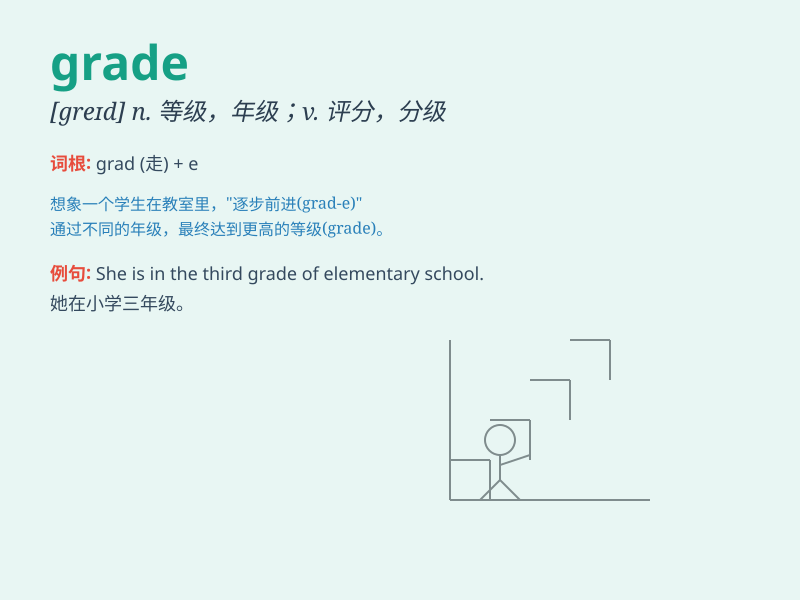

## grade

**英音:** _[greɪd]_ **美音:** _[ɡred]_

**译义:** *n.等级,级别vt.评分,评级v.分等级*

### 短语

+ **grade school:** _小学_

+ **make the grade:** _成功；达到标准_

+ **grade point average:** _平均绩点_

+ **in grade:** _在年级_

+ **grade level:** _年级水平_

### 例句

#### 例句1

> **I got an A grade in the math exam.**

**中文翻译:** 我数学考试得了A。

**单词释义:** 等级；成绩

#### 例句2

> **The road has a steep grade.**

**中文翻译:** 这条路的坡度很陡。

**单词释义:** 坡度；斜坡

#### 例句3

> **She is in the third grade.**

**中文翻译:** 她现在三年级。

**单词释义:** 年级

### 背诵小故事

> A little monkey wants to climb up the grade of the mountain to get
the delicious fruit on the top. It tries hard step by step. The grade
here means a level or a stage of something.

**一只小猴子想爬上山的斜坡去获取山顶上美味的水果。它一步一步努力攀爬。这里的
grade 意思是等级、阶段。**

### 图义

